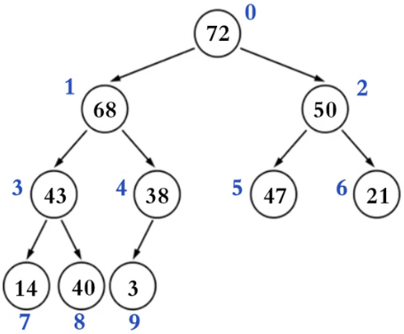

# 树

## 树基本概念

### 节点的度

子树的个数

### 树的度

所有节点中度的最大值

### 叶子节点

度为0的节点

### 非叶子节点

度不为0的节点

### 层数

根节点在第一层，依次类推

### 节点的*深度*

从根节点到当前节点的唯一路径上的节点总数

### 节点的*高度*

从当前节点到最远叶子节点的路径上的节点总数

## 二叉树

* 每个节点的度最大为2（最多拥有2棵字数）
* 左子树和右子树是有顺序的
* 即使某节点只有一棵子树，也要区分左右子树
* 有序树
* 非空二叉树的第i层，最多有2^i-1个节点
* 在高度为h的二叉树上最多有2^h -1 个节点

### 真二叉树

节点的度要么为0，要么为2

### 满二叉树

节点的度要么为0，要么为2，且所有的叶子节点都在最后一层

### 完全二叉树

叶子节点只会出现在最后二层，且最后一层的叶子节点都靠左对齐

- #### 二叉堆

二叉堆的逻辑结构就是一颗完全二叉树，所以也叫做完全二叉堆。如下图

鉴于完全二叉树的一些性质，二叉堆的底层（物理结构）一般用数组实现即可

关于数组索引（i）的规律（n是元素数量）

1. 如果i = 0，它的根节点
2. 如果i > 0，它的父节点的索引为floor(( i - 1 ) / 2)
3. 如果2i +1 ≤ n - 1，它的左子节点的索引为2i +1
4. 如果2i + 1 > n - 1，它没有左子节点
5. 如果2i + 2 ≤ n - 1，它的右子节点的索引为2i + 2
6. 如果2i + 2 > n- 1，它没有右子节点

### 前驱节点

中序遍历的前一个节点，

是左子树的最大节点

左子树的最右的节点

