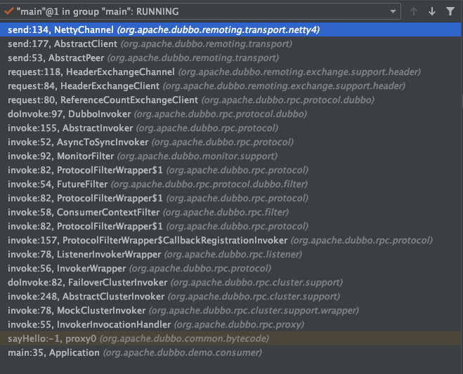
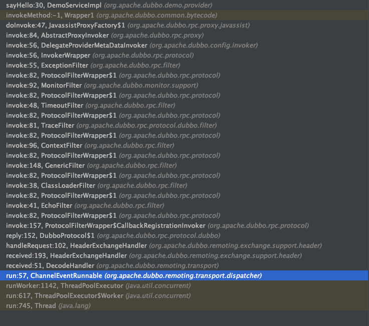

# dubbo

 

### 整体架构


### SPI

[dubbo SPI](http://dubbo.apache.org/zh-cn/docs/source_code_guide/dubbo-spi.html)

* dubbo spi

* 自适应拓展机制

  ```java
  private static final Protocol protocol = ExtensionLoader.getExtensionLoader(Protocol.class).getAdaptiveExtension();
  ```

  dubbo在使用过程中这么去使用的，自适应扩展会为@Adaptive注解的方法生成代理类；代理类的作用：

  在调用过程中通过代理类判断URL中的key(或者默认SPI中设置)类决定使用哪个扩展实现。

  Tips:一开始开代码的时候不理解为什么需要动态生成代理类，URL中有key，SPI中有默认值，直接根据key来决定使用扩展不就好了吗，但是这个想法有点想当然，正是代理类在干这个事。

  ```java
  package org.apache.dubbo.rpc;
  import org.apache.dubbo.common.extension.ExtensionLoader;
  
  public class Protocol$Adaptive implements org.apache.dubbo.rpc.Protocol {
      public void destroy() {
          throw new UnsupportedOperationException("method public abstract void org.apache.dubbo.rpc.Protocol.destroy() of interface org.apache.dubbo.rpc.Protocol is not adaptive method!");
      }
  
      public int getDefaultPort() {
          throw new UnsupportedOperationException("method public abstract int org.apache.dubbo.rpc.Protocol.getDefaultPort() of interface org.apache.dubbo.rpc.Protocol is not adaptive method!");
      }
  
      public org.apache.dubbo.rpc.Invoker refer(java.lang.Class arg0, org.apache.dubbo.common.URL arg1) throws org.apache.dubbo.rpc.RpcException {
          if (arg1 == null) throw new IllegalArgumentException("url == null");
          org.apache.dubbo.common.URL url = arg1;
          String extName = (url.getProtocol() == null ? "dubbo" : url.getProtocol());
          if (extName == null)
              throw new IllegalStateException("Fail to get extension(org.apache.dubbo.rpc.Protocol) name from url(" + url.toString() + ") use keys([protocol])");
          org.apache.dubbo.rpc.Protocol extension = (org.apache.dubbo.rpc.Protocol) ExtensionLoader.getExtensionLoader(org.apache.dubbo.rpc.Protocol.class).getExtension(extName);
          return extension.refer(arg0, arg1);
      }
  
      public org.apache.dubbo.rpc.Exporter export(org.apache.dubbo.rpc.Invoker arg0) throws org.apache.dubbo.rpc.RpcException {
          if (arg0 == null) throw new IllegalArgumentException("org.apache.dubbo.rpc.Invoker argument == null");
          if (arg0.getUrl() == null)
              throw new IllegalArgumentException("org.apache.dubbo.rpc.Invoker argument getUrl() == null");
          org.apache.dubbo.common.URL url = arg0.getUrl();
          String extName = (url.getProtocol() == null ? "dubbo" : url.getProtocol());
          if (extName == null)
              throw new IllegalStateException("Fail to get extension(org.apache.dubbo.rpc.Protocol) name from url(" + url.toString() + ") use keys([protocol])");
          org.apache.dubbo.rpc.Protocol extension = (org.apache.dubbo.rpc.Protocol) ExtensionLoader.getExtensionLoader(org.apache.dubbo.rpc.Protocol.class).getExtension(extName);
          return extension.export(arg0);
      }
  }
  ```

  

* dubbo ioc
  类似于spring的注入，不过方式是通过set方法；dubbo会判断如果有set方法会执行注入需要的类

  

  ```java
  AdaptiveExtensionFactory类：
  private final List<ExtensionFactory> factories;
  ```

  Factories:SpiExtensionFactory/SpringExtensionFactory

  注入的类会通过spi与spring加载getExtension()；@SPI注解的使用spi，否则尝试使用spring注入，

  spring是通过遍历ApplicationContext

* dubbo aop

  使用的是wrapper类，如果存在wrapper类(判断是否有对应参数type类型的构造函数),则通过wrapper类的构造函数实例化instance，此时type接口的实现已经不是原始的instance了；支持多次wrapper；

  类似spring aop的代理

  

### 服务导出

原理：ServiceBean实现ApplicationListener，当spring加载bean完成后，见：

`org.springframework.context.support.AbstractApplicationContext#refresh`

```java
public void refresh() throws BeansException, IllegalStateException {
		synchronized (this.startupShutdownMonitor) {
      //省略代码
			....
				// Initialize other special beans in specific context subclasses.
				onRefresh();

				// Check for listener beans and register them.
				registerListeners();

				// Instantiate all remaining (non-lazy-init) singletons.
				finishBeanFactoryInitialization(beanFactory);

				// Last step: publish corresponding event.
				finishRefresh();
			}
		}
	}
```

首先实现了ApplicationListener的类会通过registerListeners()方法被注册到

```
org.springframework.context.event.AbstractApplicationEventMulticaster.ListenerRetriever#applicationListenerBeans
```

集合中；`finishRefresh()`方法会遍历集合中的bean，触发其`onApplicationEvent()`方法；

服务暴露流程：

```
ServiceBean#export(触发) -> 
ServiceConfig#doExport()->#doExportUrls()->AbstractInterfaceConfig#loadRegistries(注册中心url列表)->#ServiceConfig#doExportUrlsFor1Protocol()
```

进入关键步骤：

根据scope确认是否暴露服务；为none则不暴露；判断是否只保留远程服务或本地服务；

1. exportLocal(url) 暴露本地服务
2. 暴露远程服务

```java
    private static final Protocol protocol = ExtensionLoader.getExtensionLoader(Protocol.class).getAdaptiveExtension();

    private static final ProxyFactory PROXY_FACTORY = ExtensionLoader.getExtensionLoader(ProxyFactory.class).getAdaptiveExtension();
```

这两个变量会分别生成对应的$Adapte类，调用过程中会根据invoker.getUrl()，获取对应的protcol；由于是根据registryUrl来export所以首先进入`RegistryProtocol`,但由于protocol有包装类wrapper，所以流程变为

```
ProtocolFilterWrapper(ProtocolListenerWrapper(RegistryProtocol))
```

RegistryProtocol先根据url选择协议走DubboProtocol...等协议openServer(),创建服务器，暴露监听端口；

之后需要注册到注册中心：

1. 根据registryUrl获取对应的registry,如ZookeeperRegistry
2. 创建临时节点到zookeeper


服务导出流程领域层级梳理：


首先 `ServiceConfig` 类拿到对外提供服务的实际类 ref(如：HelloWorldImpl),然后通过 `ProxyFactory` 类的 `getInvoker` 方法使用 ref 生成一个 `AbstractProxyInvoker` 实例，到这一步就完成具体服务到 `Invoker` 的转化。接下来就是 `Invoker` 转换到 `Exporter` 的过程。

补充：`Invoker`转为Exporter过程不是直接使用`DubboProtocol`等协议：

先通过`RegistryProtocol`协议，调用对应的`DubboProtocol`等协议，期间还有wrapper类参与其中；export完成之后，在`RegistryProtocol`中执行registry，将服务注册到对应的注册中心中；如zk创建临时节点


openServer涉及到的层级：

DubboProtocol->Exchanger(HeaderExchanger)->Transporter(nettyTransporter)->ExchangerServer(nettyServer)


### 服务导入


ReferenBean实现了FactoryBean,实际使用Bean的时候会调用对应的get()方法，实现了FactoryBean的bean实际上是两个Bean，一个是本身bean，一个是get方法返回的bean;

核心方法：

org.apache.dubbo.config.ReferenceConfig#createProxy

​		invoker = REF_PROTOCOL.refer(interfaceClass, urls.get(0));

​		return (T) PROXY_FACTORY.getProxy(invoker);

动态生成代理对象class代码			


### 服务字典

Directory


### 服务路由


### 集群

##### 集群容错

集群容错的所有组件。包含 Cluster、Cluster Invoker、Directory、Router 和 LoadBalance 等。


集群工作过程可分为两个阶段:

1. 第一个阶段是在服务消费者初始化期间，集群 Cluster 实现类为服务消费者创建 Cluster Invoker 实例，即上图中的 merge 操作。

2. 第二个阶段是在服务消费者进行远程调用时。以 FailoverClusterInvoker 为例，该类型 Cluster Invoker 首先会调用 Directory 的 list 方法列举 Invoker 列表（可将 Invoker 简单理解为服务提供者）。Directory 的用途是保存 Invoker，可简单类比为 List<Invoker>。其实现类 RegistryDirectory 是一个动态服务目录，可感知注册中心配置的变化，它所持有的 Invoker 列表会随着注册中心内容的变化而变化。每次变化后，RegistryDirectory 会动态增删 Invoker，并调用 Router 的 route 方法进行路由，过滤掉不符合路由规则的 Invoker。当 FailoverClusterInvoker 拿到 Directory 返回的 Invoker 列表后，它会通过 LoadBalance 从 Invoker 列表中选择一个 Invoker。最后 FailoverClusterInvoker 会将参数传给 LoadBalance 选择出的 Invoker 实例的 invoke 方法，进行真正的远程调用。

   ```
   org.apache.dubbo.rpc.cluster.support.FailoverClusterInvoker#doInvoke
   	
   ```

   

以上就是集群工作的整个流程，这里并没介绍集群是如何容错的。Dubbo 主要提供了这样几种容错方式：

- Failover Cluster - 失败自动切换

- Failfast Cluster - 快速失败

- Failsafe Cluster - 失败安全

- Failback Cluster - 失败自动恢复

- Forking Cluster - 并行调用多个服务提供者

  

### 负载均衡


### 服务调用过程

consumer端referenceBean最终生产的代理class代码：

```java
public class proxy0
implements ClassGenerator.DC,
EchoService,
DemoService {
    public static Method[] methods;
    private InvocationHandler handler;

    public String sayHello(String string) {
        Object[] arrobject = new Object[]{string};
        Object object = this.handler.invoke(this, methods[0], arrobject);
        return (String)object;
    }

    public Object $echo(Object object) {
        Object[] arrobject = new Object[]{object};
        Object object2 = this.handler.invoke(this, methods[1], arrobject);
        return object2;
    }

    public proxy0() {
    }

    public proxy0(InvocationHandler invocationHandler) {
        this.handler = invocationHandler;
    }
}
```

handler 对象：

```java
public class InvokerInvocationHandler implements InvocationHandler {
    private static final Logger logger = LoggerFactory.getLogger(InvokerInvocationHandler.class);
    private final Invoker<?> invoker;

    public InvokerInvocationHandler(Invoker<?> handler) {
        this.invoker = handler;
    }

    @Override
    public Object invoke(Object proxy, Method method, Object[] args) throws Throwable {
        String methodName = method.getName();
        Class<?>[] parameterTypes = method.getParameterTypes();
        if (method.getDeclaringClass() == Object.class) {
            return method.invoke(invoker, args);
        }
        if ("toString".equals(methodName) && parameterTypes.length == 0) {
            return invoker.toString();
        }
        if ("hashCode".equals(methodName) && parameterTypes.length == 0) {
            return invoker.hashCode();
        }
        if ("equals".equals(methodName) && parameterTypes.length == 1) {
            return invoker.equals(args[0]);
        }

        return invoker.invoke(new RpcInvocation(method, args)).recreate();
    }
}
```

可见服务调用实际使用proxy0调用了InvokerInvocationHandler.invoke()方法；最终调用包装过后的invoker来进行嵌套调用。

流程：

```text
proxy0#sayHello(String)
  —> InvokerInvocationHandler#invoke(Object, Method, Object[])
    —> MockClusterInvoker#invoke(Invocation)
      —> AbstractClusterInvoker#invoke(Invocation)
        —> FailoverClusterInvoker#doInvoke(Invocation, List<Invoker<T>>, LoadBalance)
          —> Filter#invoke(Invoker, Invocation)  // 包含多个 Filter 调用
            —> ListenerInvokerWrapper#invoke(Invocation) 
              —> AbstractInvoker#invoke(Invocation) 
                —> DubboInvoker#doInvoke(Invocation)
                  —> ReferenceCountExchangeClient#request(Object, int)
                    —> HeaderExchangeClient#request(Object, int)
                      —> HeaderExchangeChannel#request(Object, int)
                        —> AbstractPeer#send(Object)
                          —> AbstractClient#send(Object, boolean)
                            —> NettyChannel#send(Object, boolean)
                              —> NioClientSocketChannel#write(Object)
```




服务端接受请求调用：



```
NettyServerHandler#channelRead
	 —> AbstractPeer#received(Channel, Object)
    —> MultiMessageHandler#received(Channel, Object)
      —> HeartbeatHandler#received(Channel, Object)
        —> AllChannelHandler#received(Channel, Object)
          —> ExecutorService#execute(Runnable)    // 由线程池执行后续的调用逻辑 
```

```text
线程池调用：
ChannelEventRunnable#run()
  —> DecodeHandler#received(Channel, Object)
    —> HeaderExchangeHandler#received(Channel, Object)
      —> HeaderExchangeHandler#handleRequest(ExchangeChannel, Request)
        —> DubboProtocol.requestHandler#reply(ExchangeChannel, Object)
          —> Filter#invoke(Invoker, Invocation)
            —> AbstractProxyInvoker#invoke(Invocation)
              —> Wrapper0#invokeMethod(Object, String, Class[], Object[])
                —> DemoServiceImpl#sayHello(String)
```

