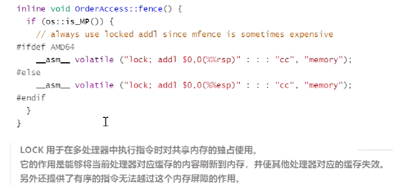

# JVM


### java 内存布局

```shell
$ java  -XX:+PrintCommandLineFlags -version
-XX:InitialHeapSize=268435456 -XX:MaxHeapSize=4294967296 -XX:+PrintCommandLineFlags 
-XX:+UseCompressedClassPointers -XX:+UseCompressedOops -XX:+UseParallelGC
java version "1.8.0_112"
Java(TM) SE Runtime Environment (build 1.8.0_112-b16)
Java HotSpot(TM) 64-Bit Server VM (build 25.112-b16, mixed mode)
```

64位虚拟机markword:


##### Markword:

8字节

##### 类型指针（Class pointer）：

指针压缩开启：4字节

不开启：8字节

##### 实例数据：

##### 对齐（padding）：

8*n


### Synchronized 实现

1. java代码 : synchronized

2. 字节码层面：jclasslib查看字节码
   monitorenter  monitorexit

3. 执行过程自动升级
   无锁--->偏向锁--->轻量级锁--->重量级锁

4. 汇编层实现
   lock  comxchg(compare and exchange)

   CAS的是先也是这样  LOCK_IF_MP

### volatile实现

1. java volatile
2. 字节码 ACC_VOLATILE
3. JVM内存屏障
   加内存屏障
   happens-before
   as-if-serial
4. 虚拟机实际实现  LOCK
5. 汇编指令 lock addl $0x0,(%rsp)
   
   缓存一致性协议：
   MESI    modify  exclusion  share  invaild   cpu缓存行数据的四种状态
6. 可见性
7. 有序性


缓存行填充：

Ringbuffer


栈上分配：逃逸分析、标量替换

逃逸分析：对象只有该线程使用，不会在其他线程使用

标量替换：将对象的成员变量直接分配在栈上，不分配对象


TLAB: thread local allocation buffer

Eden Space中开辟了一小块线程私有的区域，称作TLAB，在Java程序中很多对象都是小对象且用过即丢，它们不存在线程共享也适合被快速GC，所以对于小对象通常JVM会优先分配在TLAB上，并且TLAB上的分配由于是线程私有所以没有锁开销。


### 垃圾回收器


分代垃圾回收器

CMS几十G，开始并发回收 -

​		三色标记 + 写屏障

	>错标 需要remark

G1逻辑分代物理不分代  支持上百G

​		三色标记+SATB + 写屏障

ZGC-Shenandoah 逻辑物理都不分代    支持上T的内存垃圾回收 4T

ZGC jdk11 oracle推出的

Shenandoah openjdk jdk12推出的

Epsilon- 啥也不干  可用于调试、确认不用GC参与

##### CMS


##### G1

逻辑分代、物理不分代


### hotSpot参数分类：

```
标准： - 开头，所有HotSpot都支持
非标准： -X 开头，特定版本HotSpot支持特定命令
不稳定： -XX开头，下个版本可能取消
```

java 

Java -X

java -XX:+PrintFlagsWithComments //只有debug版本能使用


jstack ： 线程状态打印   检测死锁


### 并发并行


并发和并行都可以是很多个线程，就看这些线程能不能同时被（多个）cpu执行，如果可以就说明是并行，而并发是多个线程被（一个）cpu 轮流切换着执行。


### java 动态连接

符号引用：

java class文件编译字节码指令文件：

```java
public class X {
  public void foo() {
    bar();
  }

  public void bar() { }
}
```

它编译出来的Class文件的文本表现形式如下：

```text
Classfile /private/tmp/X.class
  Last modified Jun 13, 2015; size 372 bytes
  MD5 checksum 8abb9cbb66266e8bc3f5eeb35c3cc4dd
  Compiled from "X.java"
public class X
  SourceFile: "X.java"
  minor version: 0
  major version: 51
  flags: ACC_PUBLIC, ACC_SUPER
Constant pool:
   #1 = Methodref          #4.#16         //  java/lang/Object."<init>":()V
   #2 = Methodref          #3.#17         //  X.bar:()V
   #3 = Class              #18            //  X
   #4 = Class              #19            //  java/lang/Object
   #5 = Utf8               <init>
   #6 = Utf8               ()V
   #7 = Utf8               Code
   #8 = Utf8               LineNumberTable
   #9 = Utf8               LocalVariableTable
  #10 = Utf8               this
  #11 = Utf8               LX;
  #12 = Utf8               foo
  #13 = Utf8               bar
  #14 = Utf8               SourceFile
  #15 = Utf8               X.java
  #16 = NameAndType        #5:#6          //  "<init>":()V
  #17 = NameAndType        #13:#6         //  bar:()V
  #18 = Utf8               X
  #19 = Utf8               java/lang/Object
{
  public X();
    flags: ACC_PUBLIC
    Code:
      stack=1, locals=1, args_size=1
         0: aload_0       
         1: invokespecial #1                  // Method java/lang/Object."<init>":()V
         4: return        
      LineNumberTable:
        line 1: 0
      LocalVariableTable:
        Start  Length  Slot  Name   Signature
               0       5     0  this   LX;

  public void foo();
    flags: ACC_PUBLIC
    Code:
      stack=1, locals=1, args_size=1
         0: aload_0       
         1: invokevirtual #2                  // Method bar:()V
         4: return        
      LineNumberTable:
        line 3: 0
        line 4: 4
      LocalVariableTable:
        Start  Length  Slot  Name   Signature
               0       5     0  this   LX;

  public void bar();
    flags: ACC_PUBLIC
    Code:
      stack=0, locals=1, args_size=1
         0: return        
      LineNumberTable:
        line 6: 0
      LocalVariableTable:
        Start  Length  Slot  Name   Signature
               0       1     0  this   LX;
}
```

可以看到常量池中一条条的字节码指定，

常量池中就是各种符号引用地址；

那么虚拟机就必须解析这个符号引用。在解析时，虚拟机执行两个基本任务

1.查找被引用的类，（如果必要的话就装载它）

2.将符号引用替换为直接引用，这样当它以后再次遇到相同的引用时，它就可以立即使用这个直接引用，而不必花时间再次解析这个符号引用了。

