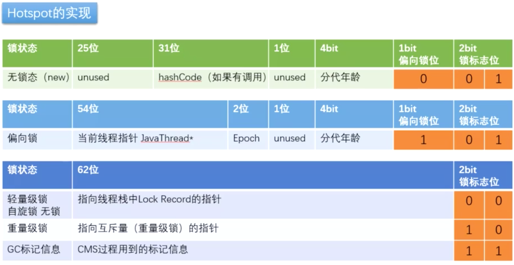
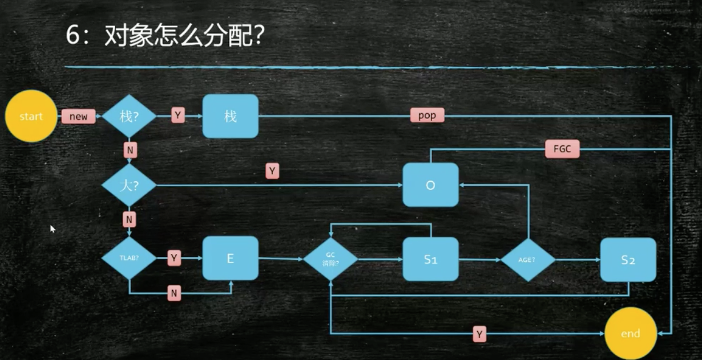
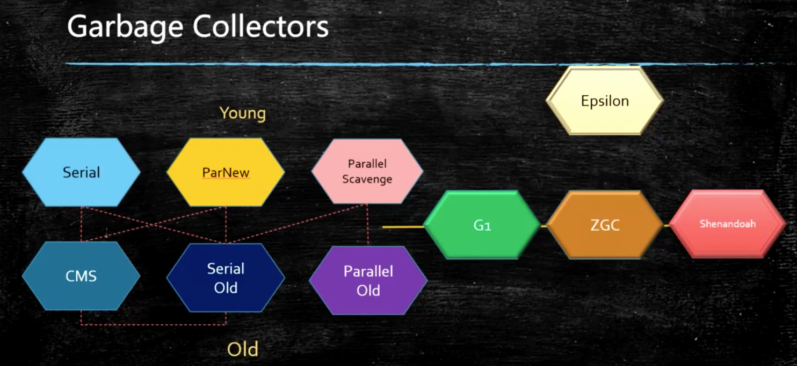
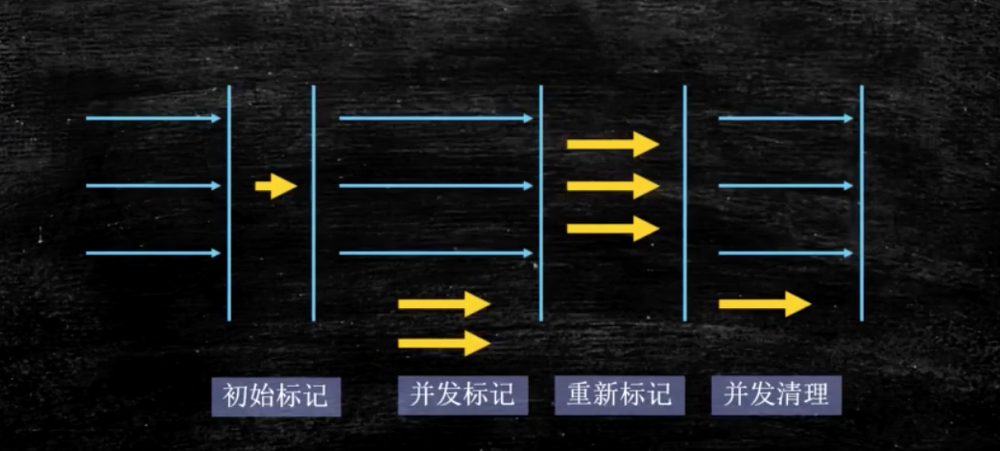
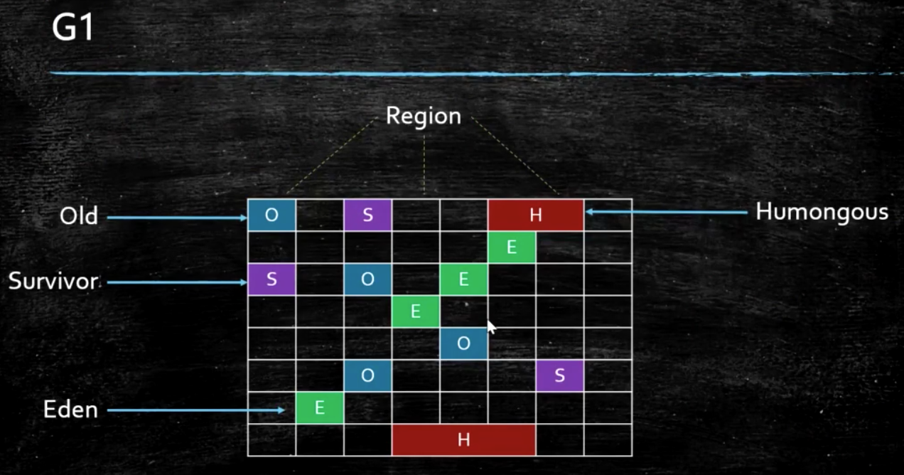

# JVM


### java 内存布局

```shell
$ java  -XX:+PrintCommandLineFlags -version
-XX:InitialHeapSize=268435456 -XX:MaxHeapSize=4294967296 -XX:+PrintCommandLineFlags 
-XX:+UseCompressedClassPointers -XX:+UseCompressedOops -XX:+UseParallelGC
java version "1.8.0_112"
Java(TM) SE Runtime Environment (build 1.8.0_112-b16)
Java HotSpot(TM) 64-Bit Server VM (build 25.112-b16, mixed mode)
```

64位虚拟机markword:



##### Markword:

8字节

##### 类型指针（Class pointer）：

指针压缩开启：4字节

不开启：8字节

##### 实例数据：

##### 对齐（padding）：

8*n


### Synchronized 实现

1. java代码 : synchronized

2. 字节码层面：jclasslib查看字节码
   monitorenter  monitorexit

3. 执行过程自动升级
   无锁--->偏向锁--->轻量级锁--->重量级锁

4. 汇编层实现
   lock  comxchg(compare and exchange)

   

### volatile实现

1. java volatile
2. 字节码 ACC_VOLATILE
3. JVM内存屏障
4. 虚拟机实际实现  LOCK
5. 可见性
6. 有序性




栈上分配：逃逸分析、标量替换

逃逸分析：对象只有该线程使用，不会在其他线程使用

标量替换：将对象的成员变量直接分配在栈上，不分配对象


TLAB: thread local allocation buffer

Eden Space中开辟了一小块线程私有的区域，称作TLAB，在Java程序中很多对象都是小对象且用过即丢，它们不存在线程共享也适合被快速GC，所以对于小对象通常JVM会优先分配在TLAB上，并且TLAB上的分配由于是线程私有所以没有锁开销。


### 垃圾回收器



分代垃圾回收器

CMS几十G，开始并发回收 -

​		三色标记 + 写屏障

	>错标 需要remark

G1逻辑分代物理不分代  支持上百G

​		三色标记+SATB + 写屏障

ZGC-Shenandoah 逻辑物理都不分代    支持上T的内存垃圾回收 4T

ZGC jdk11 oracle推出的

Shenandoah openjdk jdk12推出的

Epsilon- 啥也不干  可用于调试、确认不用GC参与

##### CMS




##### G1

逻辑分代、物理不分代




### hotSpot参数分类：

```
标准： - 开头，所有HotSpot都支持
非标准： -X 开头，特定版本HotSpot支持特定命令
不稳定： -XX开头，下个版本可能取消
```

java 

Java -X

java -XX:+PrintFlagsWithComments //只有debug版本能使用


jstack ： 线程状态打印   检测死锁