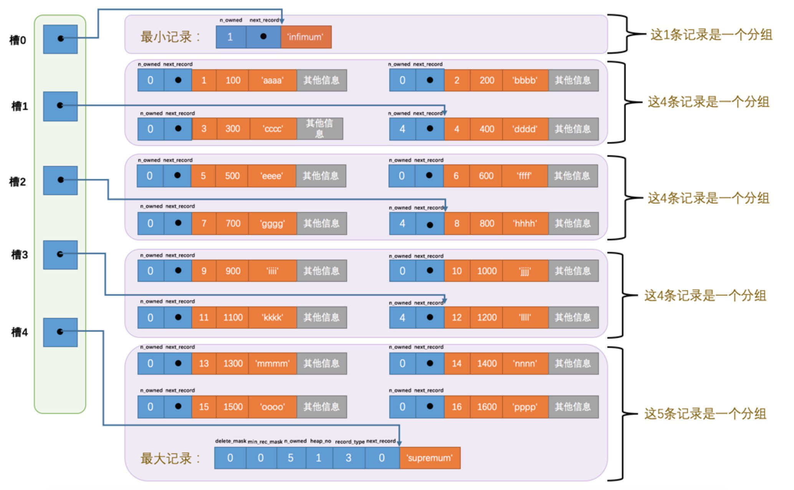
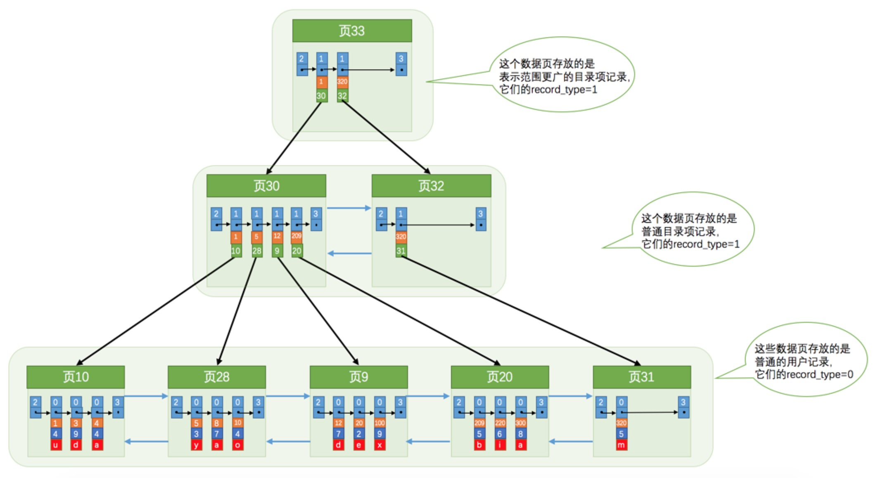

#mysql 

### mysql 行记录
四种行格式：四种行格式原理相似，细节上有些差异
* COMPACT
```
    |<---------记录的额外信息---------->|<--------记录的真实数据------------------->|
    |变长字段长度列表|null值列表|记录头信息|row_id|transaction_id|roll_pointer|列值...|
1.变长字段长度列表
    把所有变长字段的真实数据占用的字节长度都存放在记录的开头部位，从而形成一个变长字段长度列表，各变长字段数据占用的字节数按照列的顺序逆序存放
2.null值列表
    二进制位按照列的顺序逆序排列
    
3.记录头信息：    
名称	        大小（单位：bit）	描述
预留位1	        1	        没有使用
预留位2	        1	        没有使用
delete_mask	1	        标记该记录是否被删除
min_rec_mask	1	B+树的每层非叶子节点中的最小记录都会添加该标记
n_owned	        4	    表示当前记录拥有的记录数
heap_no	        13	    表示当前记录在页面堆的位置信息
n_field	        10	    表示记录中列的数量
1byte_offs_flag	1	标记字段长度偏移列表中每个列对应的偏移量是使用1字节还是2字节表示的
next_record	16	表示下一条记录的相对位置

4.row_id
    隐藏列，如果不指定主键，系统生成，指定主键的话无此列
5.       
```
* Redundant
```
    |<-----记录的额外信息--->|<--------记录的真实数据------------------->|
    |字段长度偏移列表|记录头信息|row_id|transaction_id|roll_pointer|列值...|
    
```
* Dynamic

* Compressed

Dynamic和Compressed行格式，MySQL版本是5.7，它的默认行格式就是Dynamic，这俩行格式和Compact行格式挺像，只不过在处理行溢出数据时有点儿分歧，它们不会在记录的真实数据处存储字段真实数据的前768个字节，而是把所有的字节都存储到其他页面中，只在记录的真实数据处存储其他页面的地址，就像这样：
```
  |...|溢出页的地址|...|
```
Compressed行格式和Dynamic不同的一点是，Compressed行格式会采用压缩算法对页面进行压缩，以节省空间。            
            
            

### mysql页结构
整体结构：
   
细节结构：
   
```
名称	        中文名	    占用空间大小	简单描述
File Header	 文件头部	 38字节	页的一些通用信息
Page Header	 页面头部	 56字节	数据页专有的一些信息
Infimum+Supremum 最小记录和最大记录 26字节	两个虚拟的行记录
User Records	 用户记录	 不确定	实际存储的行记录内容
Free Space	 空闲空间	 不确定	页中尚未使用的空间
Page Directory	 页面目录	 不确定	页中的某些记录的相对位置
File Trailer	 文件尾部	 8字节	校验页是否完整
```   
   

### mysql 索引
索引结构（聚簇索引）：  


二级索引：  
索引列+主键值+页号

### mysql 访问方法
1. const  
主键或唯一键等值比较
2. ref  
二级缩影等值查询
3. ref_or_null  
二级索引等值笔记 or is null
4. range    
范围查询
5. index    
查询列属于某个二级索引，但where条件在二级索引中但又使用不了，二级索引存储内容比聚簇索引少，效率高
6. all
全表扫描

### mysql join
1. 内连接      
    不加入结果集
2. 外连接  
    加入结果集
       
两者主要区别是：是否将驱动表中在被驱动表中找不到的记录也加入到结果集。

join执行原理：   
驱动表只访问一次，但被驱动表却可能被多次访问，访问次数取决于对驱动表执行单表查询后的结果集中的记录条数的连接执行方式称之为嵌套循环连接（Nested-Loop Join），这是最简单，也是最笨拙的一种连接查询算法
  
执行过程：
* 步骤1：选取驱动表，使用与驱动表相关的过滤条件，选取代价最低的单表访问方法来执行对驱动表的单表查询。  
* 步骤2：对上一步骤中查询驱动表得到的结果集中每一条记录，都分别到被驱动表中查找匹配的记录。


3. 基于块的嵌套循环连接（Block Nested-Loop Join）   
join buffer就是执行连接查询前申请的一块固定大小的内存，先把若干条驱动表结果集中的记录装在这个join buffer中，然后开始扫描被驱动表，每一条被驱动表的记录一次性和join buffer中的多条驱动表记录做匹配，因为匹配的过程都是在内存中完成的，所以这样可以显著减少被驱动表的I/O代价。使用join buffer的过程如下图所示：  

最好的情况是join buffer足够大，能容纳驱动表结果集中的所有记录，这样只需要访问一次被驱动表就可以完成连接操作了。设计MySQL的大叔把这种加入了join buffer的嵌套循环连接算法称之为基于块的嵌套连接（Block Nested-Loop Join）算法。 

