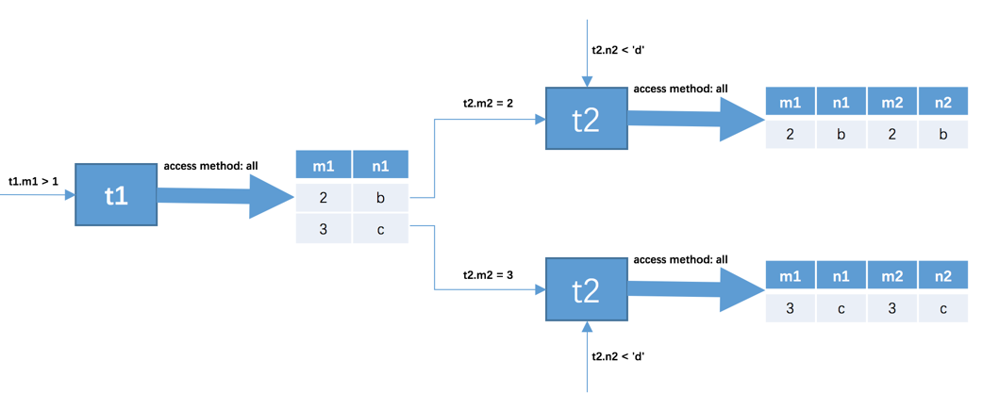
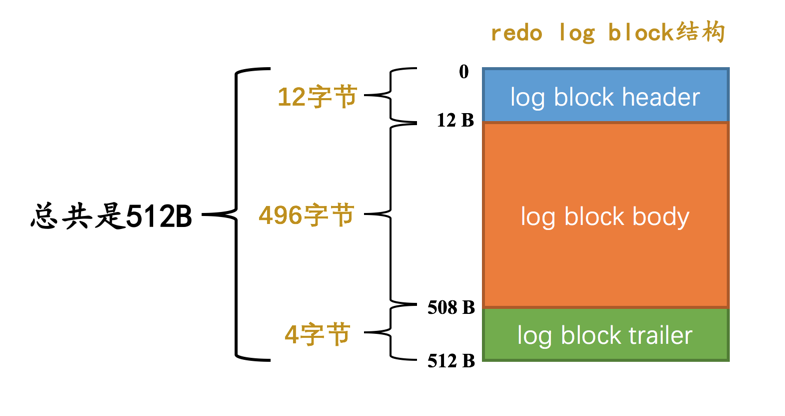
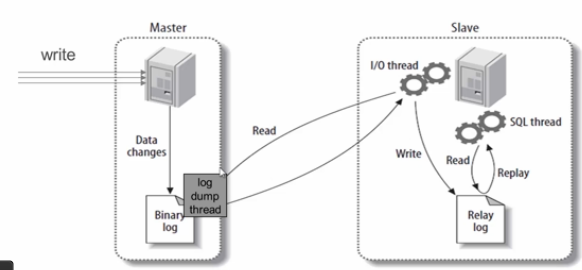

#mysql 

### mysql 行记录
四种行格式：四种行格式原理相似，细节上有些差异
* COMPACT
```
    |<---------记录的额外信息---------->|<--------记录的真实数据------------------->|
    |变长字段长度列表|null值列表|记录头信息|row_id|transaction_id|roll_pointer|列值...|
1.变长字段长度列表
    把所有变长字段的真实数据占用的字节长度都存放在记录的开头部位，从而形成一个变长字段长度列表，各变长字段数据占用的字节数按照列的顺序逆序存放
2.null值列表
    二进制位按照列的顺序逆序排列
    
3.记录头信息：    
名称	        大小（单位：bit）	描述
预留位1	        1	        没有使用
预留位2	        1	        没有使用
delete_mask	1	        标记该记录是否被删除
min_rec_mask	1	B+树的每层非叶子节点中的最小记录都会添加该标记
n_owned	        4	    表示当前记录拥有的记录数
heap_no	        13	    表示当前记录在页面堆的位置信息
n_field	        10	    表示记录中列的数量
1byte_offs_flag	1	标记字段长度偏移列表中每个列对应的偏移量是使用1字节还是2字节表示的
next_record	16	表示下一条记录的相对位置

4.row_id
    隐藏列，如果不指定主键，系统生成，指定主键的话无此列
5.transaction_id
    事务id
6.roll_pointer
    回滚指针           
```
* Redundant
```
    |<-----记录的额外信息--->|<--------记录的真实数据------------------->|
    |字段长度偏移列表|记录头信息|row_id|transaction_id|roll_pointer|列值...|
    
```
* Dynamic

* Compressed

Dynamic和Compressed行格式，MySQL版本是5.7，它的默认行格式就是Dynamic，这俩行格式和Compact行格式挺像，只不过在处理行溢出数据时有点儿分歧，它们不会在记录的真实数据处存储字段真实数据的前768个字节，而是把所有的字节都存储到其他页面中，只在记录的真实数据处存储其他页面的地址，就像这样：
```
  |...|溢出页的地址|...|
```
Compressed行格式和Dynamic不同的一点是，Compressed行格式会采用压缩算法对页面进行压缩，以节省空间。            
            
            

### mysql页结构
整体结构：
   
细节结构：
   
```
名称	        中文名	    占用空间大小	简单描述
File Header	 文件头部	 38字节	页的一些通用信息
Page Header	 页面头部	 56字节	数据页专有的一些信息
Infimum+Supremum 最小记录和最大记录 26字节	两个虚拟的行记录
User Records	 用户记录	 不确定	实际存储的行记录内容
Free Space	 空闲空间	 不确定	页中尚未使用的空间
Page Directory	 页面目录	 不确定	页中的某些记录的相对位置
File Trailer	 文件尾部	 8字节	校验页是否完整
```   
   

### mysql 索引
索引结构（聚簇索引）：  

record_type:记录头信息的一项属性，表示记录的类型，0表示普通记录、2表示最小记录、3表示最大记录、1目录项记录   
next_record:记录头信息的一项属性，表示下一条地址相对于本条记录的地址偏移量，为了方便大家理解，我们都会用箭头来表明下一条记录是谁。

二级索引：  
索引列+主键值+页号
二级索引页为什么要存主键：   
为了让新插入记录能找到自己在那个页里，我们需要保证在B+树的同一层内节点的目录项记录除页号这个字段以外是唯一的；
否则只存页号当同一个二级索引字段存在多个页中时，新插入相同列数据则无法
确定存到哪个页中。


### mysql 访问方法
1. const  
主键或唯一键等值比较
2. ref  
二级索引等值查询
3. ref_or_null  
二级索引等值笔记 or is null
4. range    
范围查询
5. index    
查询列属于某个二级索引，但where条件在二级索引中但又使用不了，二级索引存储内容比聚簇索引少，效率高
6. all
全表扫描

### mysql join
1. 内连接      
    不加入结果集
2. 外连接  
    加入结果集
       
两者主要区别是：是否将驱动表中在被驱动表中找不到的记录也加入到结果集。

join执行原理：   
驱动表只访问一次，但被驱动表却可能被多次访问，访问次数取决于对驱动表执行单表查询后的结果集中的记录条数的连接执行方式称之为嵌套循环连接（Nested-Loop Join），这是最简单，也是最笨拙的一种连接查询算法
  
执行过程：
* 步骤1：选取驱动表，使用与驱动表相关的过滤条件，选取代价最低的单表访问方法来执行对驱动表的单表查询。  
* 步骤2：对上一步骤中查询驱动表得到的结果集中每一条记录，都分别到被驱动表中查找匹配的记录。




3. 基于块的嵌套循环连接（Block Nested-Loop Join）   
join buffer就是执行连接查询前申请的一块固定大小的内存，先把若干条驱动表结果集中的记录装在这个join buffer中，然后开始扫描被驱动表，每一条被驱动表的记录一次性和join buffer中的多条驱动表记录做匹配，因为匹配的过程都是在内存中完成的，所以这样可以显著减少被驱动表的I/O代价。使用join buffer的过程如下图所示：  

最好的情况是join buffer足够大，能容纳驱动表结果集中的所有记录，这样只需要访问一次被驱动表就可以完成连接操作了。设计MySQL的大叔把这种加入了join buffer的嵌套循环连接算法称之为基于块的嵌套连接（Block Nested-Loop Join）算法。 

### mysql成本优化
成本：
* I/O成本
* cpu成本   
```
对于InnoDB存储引擎来说，页是磁盘和内存之间交互的基本单位，
MySQL规定读取一个页面花费的成本默认是1.0，
读取以及检测一条记录是否符合搜索条件的成本默认是0.2（不管读取记录时需不需要检测是否满足搜索条件，其成本都算是0.2）。
1.0、0.2这些数字称之为成本常数
```
评估回表操作的I/O成本依旧很豪放，每次回表操作都相当于访问一个页面，成本为1.0

### InnoDB 统计数据
InnoDB提供了两种存储统计数据的方式：

* 永久性的统计数据  
    这种统计数据存储在磁盘上，也就是服务器重启之后这些统计数据还在。
存储在两张表中：
1. innodb_table_stats

```text
                     
    字段名	        描述
    database_name	数据库名
    table_name	    表名
    last_update	    本条记录最后更新时间
    n_rows	        表中记录的条数
    clustered_index_size	表的聚簇索引占用的页面数量
    sum_of_other_index_sizes	表的其他索引占用的页面数量
    
    n_rows：估计值
    按照一定算法（并不是纯粹随机的）选取几个叶子节点页面，计算每个页面中主键值记录数量，
    然后计算平均一个页面中主键值的记录数量乘以全部叶子节点的数量就算是该表的n_rows值。
    innodb_stats_persistent_sample_pages的系统变量来控制使用永久性的统计数据时，
    计算统计数据时采样的页面数量。该值设置的越大，统计出的n_rows值越精确，
    但是统计耗时也就最久；该值设置的越小，统计出的n_rows值越不精确，但是统计耗时特别少
    
```          
    
    
2. innodb_index_stats：
```text
字段名	描述
database_name	数据库名
table_name	表名
index_name	索引名
last_update	本条记录最后更新时间
stat_name	统计项的名称
stat_value	对应的统计项的值
sample_size	为生成统计数据而采样的页面数量
stat_description	对应的统计项的描述

```

* 非永久性的统计数据     
    这种统计数据存储在内存中，当服务器关闭时这些这些统计数据就都被清除掉了，等到服务器重启之后，在某些适当的场景下才会重新收集这些统计数据。

### InnoDB 的Buffer Pool
为了缓存磁盘中的页，在MySQL服务器启动的时候就向操作系统申请了一片连续的内存，他们给这片内存起了个名，叫做Buffer Pool（中文名是缓冲池）     
#### buffer pool的组成：     
控制块和缓存页是一一对应的，它们都被存放到 Buffer Pool 中，其中控制块被存放到 Buffer Pool 的前边，缓存页被存放到 Buffer Pool 后边 

*  free链表的管理            
    把所有空闲的缓存页对应的控制块作为一个节点放到一个链表中，这个链表也可以被称作free链表（或者说空闲链表）.  
    表空间号 + 页号作为key，缓存页作为value创建一个哈希表
*  flush链表的管理   
凡是修改过的缓存页对应的控制块都会作为一个节点加入到一个链表中，
因为这个链表节点对应的缓存页都是需要被刷新到磁盘上的，
所以也叫flush链表
 
* LRU链表   
#### 总结
磁盘太慢，用内存作为缓存很有必要。

Buffer Pool本质上是InnoDB向操作系统申请的一段连续的内存空间，可以通过innodb_buffer_pool_size来调整它的大小。

Buffer Pool向操作系统申请的连续内存由控制块和缓存页组成，每个控制块和缓存页都是一一对应的，在填充足够多的控制块和缓存页的组合后，Buffer Pool剩余的空间可能产生不够填充一组控制块和缓存页，这部分空间不能被使用，也被称为碎片。

InnoDB使用了许多链表来管理Buffer Pool。

free链表中每一个节点都代表一个空闲的缓存页，在将磁盘中的页加载到Buffer Pool时，会从free链表中寻找空闲的缓存页。

为了快速定位某个页是否被加载到Buffer Pool，使用表空间号 + 页号作为key，缓存页作为value，建立哈希表。

在Buffer Pool中被修改的页称为脏页，脏页并不是立即刷新，而是被加入到flush链表中，待之后的某个时刻同步到磁盘上。

LRU链表分为young和old两个区域，可以通过innodb_old_blocks_pct来调节old区域所占的比例。首次从磁盘上加载到Buffer Pool的页会被放到old区域的头部，在innodb_old_blocks_time间隔时间内访问该页不会把它移动到young区域头部。在Buffer Pool没有可用的空闲缓存页时，会首先淘汰掉old区域的一些页。

我们可以通过指定innodb_buffer_pool_instances来控制Buffer Pool实例的个数，每个Buffer Pool实例中都有各自独立的链表，互不干扰。

自MySQL 5.7.5版本之后，可以在服务器运行过程中调整Buffer Pool大小。每个Buffer Pool实例由若干个chunk组成，每个chunk的大小可以在服务器启动时通过启动参数调整。

可以用下边的命令查看Buffer Pool的状态信息：

SHOW ENGINE INNODB STATUS\G    

### mysql事务
#### ACID
1. A 原子性   
    要么都成功要么都失败；实现原理：undo log；
2. C 一致性   
    符合约束条件（与自然规律相符），比如余额不能小于0，性别是男和女等；
    一致性是实现目的，AID是实现手段，当然符合AID不一定符合C
3. I 隔离性   
    多线程同时执行互不影响；实现原理：锁、MVCC
4. D 持久性    
    执行后的结果永久保留；实现原理：redo log；
    
#### 事务状态
* 活动的（active）

事务对应的数据库操作正在执行过程中时，我们就说该事务处在活动的状态。

* 部分提交的（partially committed）

当事务中的最后一个操作执行完成，但由于操作都在内存中执行，所造成的影响并没有刷新到磁盘时，我们就说该事务处在部分提交的状态。

* 失败的（failed）

当事务处在活动的或者部分提交的状态时，可能遇到了某些错误（数据库自身的错误、操作系统错误或者直接断电等）而无法继续执行，或者人为的停止当前事务的执行，我们就说该事务处在失败的状态。

* 中止的（aborted）

如果事务执行了半截而变为失败的状态，就是要撤销失败事务对当前数据库造成的影响。书面一点的话，我们把这个撤销的过程称之为回滚。当回滚操作执行完毕时，也就是数据库恢复到了执行事务之前的状态，我们就说该事务处在了中止的状态。

* 提交的（committed）

当一个处在部分提交的状态的事务将修改过的数据都同步到磁盘上之后，我们就可以说该事务处在了提交的状态。

 

### redo log    
redo日志会把事务在执行过程中 对数据库所做的所有修改都记录下来，在之后系统奔溃重启后可以把事务所做的任何修改都恢复出来。  
redo日志本质上只是记录了一下事务对数据库做了哪些修改。
1. redo log 通用日志格式
```text
|type|space ID|page number|data|

type：该条redo日志的类型。

在MySQL 5.7.21这个版本中，设计InnoDB的大叔一共为redo日志设计了53种不同的类型，稍后会详细介绍不同类型的redo日志。

space ID：表空间ID。

page number：页号。

data：该条redo日志的具体内容。
```
2. MLOG_8BYTE的redo日志结构   
```text
|type|space ID|page number|offset|data|

```
3. MLOG_WRITE_STRING的redo日志结构   
```text
|type|space ID|page number|offset|len|data|

len:具体数据占用的字节数
```


#### Mini-Transaction
1. 以组的形式写入redo日志    
语句在执行过程中可能涉及修改多个页，生成多条redo log；在执行语句的过程中产生的redo日志被划分成了若干个不可分割的组
2. Mini-Transaction的概念  
对底层页面中的一次原子访问的过程称之为一个Mini-Transaction，简称mtr，比如上边所说的修改一次Max Row ID的值算是一个Mini- Transaction，向某个索引对应的B+树中插入一条记录的过程也算是一个Mini-Transaction。通过上边的叙述我们也知道，一个所谓的mtr可以包含一组redo日志，在 进行奔溃恢复时这一组redo日志作为一个不可分割的整体。    

#### redo log写入过程
1. redo log block

2. redo log buffer  

3. redo日志写入log buffer  
   

#### redo log 刷盘
我们前边说mtr运行过程中产生的一组redo日志在mtr结束时会被复制到log buffer中，可是这些日志总在内存里呆着也不是个办法，在一些情况下它们会被刷新到磁盘 里，比如:
* log buffer空间不足时    
log buffer的大小是有限的(通过系统变量innodb_log_buffer_size指定)，如果不停的往这个有限大小的log buffer里塞入日志，很快它就会被填满。设
如果当前写入log buffer的redo日志量已经占满了log buffer总容量的大约一半左右，就需要把这些日志刷新到磁盘上。 
* 事务提交时         
我们前边说过之所以使用redo日志主要是因为它占用的空间少，还是顺序写，在事务提交时可以不把修改过的Buffer Pool页面刷新到磁盘，但是为了保证持久性， 必须要把修改这些页面对应的redo日志刷新到磁盘。
* 后台线程不停的刷刷刷    
后台有一个线程，大约每秒都会刷新一次log buffer中的redo日志到磁盘。
* 正常关闭服务器时 
* 做所谓的checkpoint时
* 其他的一些情况...

#### redo log文件组        
* innodb_log_group_home_dir  
该参数指定了redo日志文件所在的目录，默认值就是当前的数据目录。 
* innodb_log_file_size  
该参数指定了每个redo日志文件的大小，在MySQL 5.7.21这个版本中的默认值为48MB， 
* innodb_log_files_in_group     
该参数指定redo日志文件的个数，默认值为2，最大值为100。


### undo log
用于保障事务的原子性，把回滚时所需的东西都给记下来：
* 你插入一条记录时，至少要把这条记录的主键值记下来，之后回滚的时候只需要把这个主键值对应的记录删掉就好了。
* 你删除了一条记录，至少要把这条记录中的内容都记下来，这样之后回滚时再把由这些内容组成的记录插入到表中就好了。    
* 你修改了一条记录，至少要把修改这条记录前的旧值都记录下来，这样之后回滚时再把这条记录更新为旧值就好了。

#### undo log 日志格式
1. insert   

行记录中的roll_pointer对应的就是这个undo log的地址
2. delete   
删除分两个阶段：
* 仅仅将记录的delete_mask标识位设置为1，其他的不做修改（其实会修改记录的trx_id、roll_pointer这些隐藏列的值）

* 当该删除语句所在的事务提交之后，会有专门的线程后来真正的把记录删除掉。所谓真正的删除就是把该记录从正常记录链表中移除，并且加入到垃圾链表中，然后还要调整一些页面的其他信息，比如页面中的用户记录数量PAGE_N_RECS、上次插入记录的位置PAGE_LAST_INSERT、垃圾链表头节点的指针PAGE_FREE、页面中可重用的字节数量PAGE_GARBAGE、还有页目录的一些信息等等。这个阶段称之为purge。    

3. update   
* 不更新主键的情况   
    i. 就地更新（in-place update）    
        更新记录时，对于被更新的每个列来说，如果更新后的列和更新前的列占用的存储空间都一样大，那么就可以进行就地更新.  
    ii. 先删除掉旧记录，再插入新记录  
        在不更新主键的情况下，如果有任何一个被更新的列更新前和更新后占用的存储空间大小不一致，那么就需要先把这条旧的记录从聚簇索引页面中删除掉，然后再根据更新后列的值创建一条新的记录插入到页面中。  
        请注意一下，我们这里所说的删除并不是delete mark操作，而是真正的删除掉，也就是把这条记录从正常记录链表中移除并加入到垃圾链表中，并且修改页面中相应的统计信息（比如PAGE_FREE、PAGE_GARBAGE等这些信息）。不过这里做真正删除操作的线程并不是在唠叨DELETE语句中做purge操作时使用的另外专门的线程，而是由用户线程同步执行真正的删除操作，真正删除之后紧接着就要根据各个列更新后的值创建的新记录插入。   
        这里如果新创建的记录占用的存储空间大小不超过旧记录占用的空间，那么可以直接重用被加入到垃圾链表中的旧记录所占用的存储空间，否则的话需要在页面中新申请一段空间以供新记录使用，如果本页面内已经没有可用的空间的话，那就需要进行页面分裂操作，然后再插入新记录。
           
* 更新主键的情况   
1. 将旧记录进行delete mark操作  
高能注意：这里是delete mark操作！这里是delete mark操作！这里是delete mark操作！也就是说在UPDATE语句所在的事务提交前，对旧记录只做一个delete mark操作，在事务提交后才由专门的线程做purge操作，把它加入到垃圾链表中。这里一定要和我们上边所说的在不更新记录主键值时，先真正删除旧记录，再插入新记录的方式区分开！
小贴士： 之所以只对旧记录做delete mark操作，是因为别的事务同时也可能访问这条记录，如果把它真正的删除加入到垃圾链表后，别的事务就访问不到了。这个功能就是所谓的MVCC.
2. 根据更新后各列的值创建一条新记录，并将其插入到聚簇索引中（需重新定位插入的位置）。    
由于更新后的记录主键值发生了改变，所以需要重新从聚簇索引中定位这条记录所在的位置，然后把它插进去。

### 事务隔离级别
事务并发问题：
1. 脏写：不允许发生   
如果一个事务修改了另一个事务未提交的数据；
2. 脏读   
一个事务读取到另一个事务未提交的数据
3. 不可重复读
在同一个事务查询中，同一记录读取到不同数据
4. 幻读   
同一事务中相同查询，后面的查询查询出了新的记录。（如果后面查询发现缺少了记录，则是不可重复读）

#### 隔离级别：
* READ UNCOMMITTED：读未提交。
* READ COMMITTED：已提交读。
* REPEATABLE READ：可重复读。
* SERIALIZABLE：可串行化。
```text
隔离级别	            脏读	                不可重复读	幻读
READ UNCOMMITTED	Possible	Possible	Possible
READ COMMITTED	    Not Possible	Possible	Possible
REPEATABLE READ	    Not Possible	Not Possible	Possible
SERIALIZABLE	    Not Possible	Not Possible	Not Possible

注意：在mysql的InnoDB引擎中 RR级别可防止幻读
```
### MVCC原理
#### 版本链
记录每次更新后，都会将旧值放到一条undo日志中，就算是该记录的一个旧版本，随着更新次数的增多，所有的版本都会被roll_pointer属性连接成一个链表，我们把这个链表称之为版本链，版本链的头节点就是当前记录最新的值。  

#### ReadView
* m_ids：表示在生成ReadView时当前系统中活跃的读写事务的事务id列表。  
* min_trx_id：表示在生成ReadView时当前系统中活跃的读写事务中最小的事务id，也就是m_ids中的最小值。  
* max_trx_id：表示生成ReadView时系统中应该分配给下一个事务的id值。
小贴士： 注意max_trx_id并不是m_ids中的最大值，事务id是递增分配的。比方说现在有id为1，2，3这三个事务，之后id为3的事务提交了。那么一个新的读事务在生成ReadView时，m_ids就包括1和2，min_trx_id的值就是1，max_trx_id的值就是4。
* creator_trx_id：表示生成该ReadView的事务的事务id。  
小贴士： 我们前边说过，只有在对表中的记录做改动时（执行INSERT、DELETE、UPDATE这些语句时）才会为事务分配事务id，否则在一个只读事务中的事务id值都默认为0。

有了这个ReadView，这样在访问某条记录时，只需要按照下边的步骤判断记录的某个版本是否可见：
1. 如果被访问版本的trx_id属性值与ReadView中的creator_trx_id值相同，意味着当前事务在访问它自己修改过的记录，所以该版本可以被当前事务访问。
2. 如果被访问版本的trx_id属性值小于ReadView中的min_trx_id值，表明生成该版本的事务在当前事务生成ReadView前已经提交，所以该版本可以被当前事务访问。
3. 如果被访问版本的trx_id属性值大于ReadView中的max_trx_id值，表明生成该版本的事务在当前事务生成ReadView后才开启，所以该版本不可以被当前事务访问。
4. 如果被访问版本的trx_id属性值在ReadView的min_trx_id和max_trx_id之间，那就需要判断一下trx_id属性值是不是在m_ids列表中，如果在，说明创建ReadView时生成该版本的事务还是活跃的，该版本不可以被访问；如果不在，说明创建ReadView时生成该版本的事务已经被提交，该版本可以被访问。  
5. 如果某个版本的数据对当前事务不可见的话，那就顺着版本链找到下一个版本的数据，继续按照上边的步骤判断可见性，依此类推，直到版本链中的最后一个版本。如果最后一个版本也不可见的话，那么就意味着该条记录对该事务完全不可见，查询结果就不包含该记录。  

所谓的MVCC（Multi-Version Concurrency Control ，多版本并发控制）指的就是在使用READ COMMITTD、REPEATABLE READ这两种隔离级别的事务在执行普通的SEELCT操作时访问记录的版本链的过程，这样子可以使不同事务的读-写、写-读操作并发执行，从而提升系统性能。READ COMMITTD、REPEATABLE READ这两个隔离级别的一个很大不同就是：生成ReadView的时机不同，READ COMMITTD在每一次进行普通SELECT操作前都会生成一个ReadView，而REPEATABLE READ只在第一次进行普通SELECT操作前生成一个ReadView，之后的查询操作都重复使用这个ReadView就好了。

#### 关于purge
* 我们说insert undo在事务提交之后就可以被释放掉了，而update undo由于还需要支持MVCC，不能立即删除掉。
* 为了支持MVCC，对于delete mark操作来说，仅仅是在记录上打一个删除标记，并没有真正将它删除掉。 

随着系统的运行，在确定系统中包含最早产生的那个ReadView的事务不会再访问某些update undo日志以及被打了删除标记的记录后，有一个后台运行的purge线程会把它们真正的删除掉

### mysql 锁
支持各种隔离级别的方法：
1. MVCC
2. 锁

#### 一致性读（快照读）
读不加锁

#### 锁定读 （当前读）
* 共享锁，英文名：Shared Locks，简称S锁。在事务要读取一条记录时，需要先获取该记录的S锁。
    SELECT ... LOCK IN SHARE MODE;
* 独占锁，也常称排他锁，英文名：Exclusive Locks，简称X锁。在事务要改动一条记录时，需要先获取该记录的X锁。
    SELECT ... FOR UPDATE;

#### 多粒度锁  
* 表级锁
   1. 表级X、S锁    
    在对某个表执行SELECT、INSERT、DELETE、UPDATE语句时，InnoDB存储引擎是不会为这个表添加表级别的S锁或者X锁的。
    另外，在对某个表执行一些诸如ALTER TABLE、DROP TABLE这类的DDL语句时，其他事务对这个表并发执行诸如SELECT、INSERT、DELETE、UPDATE的语句会发生阻塞，同理，某个事务中对某个表执 行SELECT、INSERT、DELETE、UPDATE语句时，在其他会话中对这个表执行DDL语句也会发生阻塞。这个过程其实是通过在server层使用一种称之为元数据锁(英文名:Metadata Locks，简称MDL)东东 来实现的，一般情况下也不会使用InnoDB存储引擎自己提供的表级别的S锁和X锁。
   2. 意向共享锁，英文名：Intention Shared Lock，简称IS锁。当事务准备在某条记录上加S锁时，需要先在表级别加一个IS锁。
   3. 意向独占锁，英文名：Intention Exclusive Lock，简称IX锁。当事务准备在某条记录上加X锁时，需要先在表级别加一个IX锁。      
   ```text
  IS、IX锁是表级锁，它们的提出仅仅为了在之后加表级别的S锁和X锁时可以快速判断表中的记录是否被上锁，以避免用遍历的方式来查看表中有没有上锁的记录，也就是说其实IS锁和IX锁是兼容的，IX锁和IX锁是兼容的；可以解决上锁之前需要遍历是否有行级锁
   ```
   4. 表级Auto-Inc锁
    系统在自动给AUTO_INCREMENT修饰的列递增赋值的原理主要是两个：   
        a. 采用AUTO-INC锁，在表级级添加一个AUTO-INC锁，然后为每条待插入记录的AUTO_INCREMENT修饰的列分配递增的值，在该语句执行结束后，再把AUTO-INC锁释放掉；
        这样一个事务在持有AUTO-INC锁的过程中，其他事务的插入语句都要被阻塞，可以保证一个语句中分配的递增值是连续的。
        如果我们的插入语句在执行前不可以确定具体要插入多少条记录，一般使用这种方式   
        b. 采用一个轻量级的锁，在为插入语句生成AUTO_INCREMENT修饰的列的值时获取一下这个轻量级锁，然后生成本次插入语句需要用到的AUTO_INCREMENT列的值之后，就把该轻量级锁释放掉，并不需要等到整个插入语句执行完才释放锁。
 * 行级锁
 1. Record Locks：   
 S锁、X锁
 2. Gap锁：   
 MySQL在REPEATABLE READ隔离级别下是可以解决幻读问题的，解决方案有两种，可以使用MVCC方案解决，也可以采用加锁方案解决。
 3. Next-Key Locks:  
 next-key锁的本质就是一个记录锁（S、X锁）和一个gap锁的合体
 4. Insert Intention Locks:插入意向锁    
 一个事务在插入一条记录时需要判断一下插入位置是不是被别的事务加了所谓的gap锁(next-key锁也包含gap锁，后边就不强调了)，如果有的话，插入操作需要等待，直到拥有gap锁的那个 事务提交  
 5. 隐式锁：    
 如果在当前事务中新插入一条聚簇索引记录后，该记录的trx_id隐藏列代表的的就是当 前事务的事务id，如果其他事务此时想对该记录添加S锁或者X锁时，首先会看一下该记录的trx_id隐藏列代表的事务是否是当前的活跃事务，如果是的话，那么就帮助当前事务创建一个X锁(也 就是为当前事务创建一个锁结构，is_waiting属性是false)，然后自己进入等待状态(也就是为自己也创建一个锁结构，is_waiting属性是true)。  
 
 ### mysql主从同步
 1. 主从同步步骤：  
    a. 当master上的数据发生变化时，该事件变化会按照顺序写入bin-log中。当slave链接到master的时候，master机器会为slave开启binlog dump线程。当master的binlog发生变化的时候，bin-log dump线程会通知slave，并将相应的binlog内容发送给slave。 
    b. 当主从同步开启的时候，slave上会创建两个线程：I\O线程。该线程连接到master机器，master机器上的binlog dump 线程会将binlog的内容发送给该I\O线程。该I/O线程接收到binlog内容后，再将内容写入到本地的relay log；sql线程。该线程读取到I/O线程写入的ralay log。并且根据relay log。并且根据relay log 的内容对slave数据库做相应的操作。  
 2. 主从复制原理：
    
    从库生成两个线程，一个I/O线程，一个SQL线程；   
    i/o线程去请求主库 的binlog，并将得到的binlog日志写到relay log（中继日志） 文件中；  
    主库会生成一个 log dump 线程，用来给从库 i/o线程传binlog； 
 3. 主从延时问题：  
    主库针对写操作，顺序写binlog，从库单线程去主库顺序读”写操作的binlog”，从库取到binlog在本地原样执行（随机写），来保证主从数据逻辑上一致。mysql的主从复制都是单线程的操作，主库对所有DDL和DML产生binlog，binlog是顺序写，所以效率很高，slave的Slave_IO_Running线程到主库取日志，效率比较高，下一步，问题来了，slave的Slave_SQL_Running线程将主库的DDL和DML操作在slave实施。DML和DDL的IO操作是随即的，不是顺序的，成本高很多，还可能可slave上的其他查询产生lock争用，由于Slave_SQL_Running也是单线程的，所以一个DDL卡主了，需要执行10分钟，那么所有之后的DDL会等待这个DDL执行完才会继续执行，这就导致了延时。有朋友会问：“主库上那个相同的DDL也需要执行10分，为什么slave会延时？”，答案是master可以并发，Slave_SQL_Running线程却不可以。 
 4. 主从延时解决方案：
    https://blog.csdn.net/helloxiaozhe/article/details/79548186          
 #### mysql 半同步         
 

