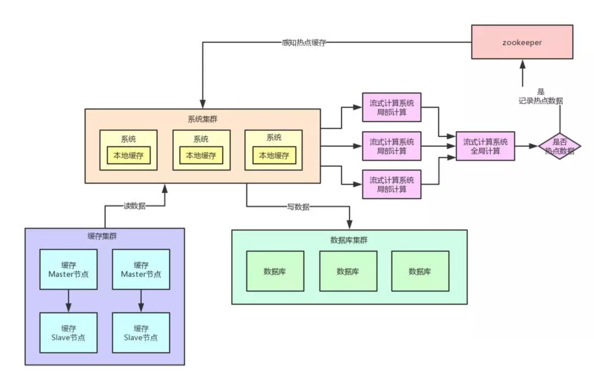

# redis

Redis是一个开源的内存中的数据结构存储系统

### redis 数据类型

##### 字符串(String)

常用数据类型  二进制数据安全字节数组
session 对象  小文件

incr 用做计数可保证原子性

bitmap：


##### 散列(Hash)


hgetall:获取所有商品

hset：添加商品

hincrby：添加数量

hlen:商品总数

hdel:删除商品


##### 类表(List)

**BLPOP** : 从左边弹出元素，如果无元素，根据timeout阻塞等待

**BRPOP** : 从右边弹出元素 

```
stack(栈)=LPUSH + LPOP -> FILO

queue(对列)=LPUSH + RPOP -> FIFO

Blocking Queue(阻塞队列) = LPUSH + BRPOP
```

**最新列表**

Redis列表结构，LPUSH可以在列表头部插入一个内容ID作为关键字，LTRIM可用来限制列表的数量，这样列表永远为N个ID，无需查询最新的列表，直接根据ID去到对应的内容页即可


##### 集合(Set)

共同关注模型

集合求并集/交集/差集

随机事件

srangeMember：

推荐系统：

共同好友：交集

推荐好友：差集


##### 有序集合(ZSet/Sorted Set)

skipList

### 跳表

空间换时间

升维


### 事务


### redis 线程模型


### redis集群

hash slots 16384

主从

不保证数据强一致性，异步复制

### redis哨兵

```
  主备模式 主挂了，虽然有slave 但是我们应用程序不能直接切过去         哨兵机制，当主节点发生故障时，自动完成故障转移并通知应用程序实现高可用        三台哨    哨兵做以下三件事情    1、每隔10秒向主节点发送info 获取 master 和slave的信息    2、每隔2秒 使用发布订阅方式 相互发现 哨兵们    3、每隔和master进行ping pong操作        假如一半的哨兵认为master挂了    选举出来一个哨兵 来做故障转移    故障转移完成后，把master的节点的信息都同步到各个哨兵的文件里面	    哨兵集群对外提供服务。。客户端直接连接哨兵的ip + 端口
```

### redis持久化

#### RDB

```
rdb文件恢复快， fork一个与当前进程一样的子进程来持久化
        save 阻塞redis 直到rbd全部完成
        bgsave 子线程去持久化
        
        优点：1，压缩后的二进制文，适用于备份、全量复制，用于灾难恢复
             2，加载RDB恢复数据远快于AOF方式
        缺点：1，无法做到实时持久化，每次都要创建子进程，频繁操作成本过高
             2，保存后的二进制文件，存在老版本不兼容新版本rdb文件
```

#### AOF

```
保存的是执行命令，恢复慢 可以实时持久化   
有冗余  --->重写
       redis.conf    appendonly yes (no)
       
       如何从AOF恢复？
       1. 设置appendonly yes；
       2. 将appendonly.aof放到dir参数指定的目录；
       3. 启动Redis，Redis会自动加载appendonly.aof文件。
       
       redis重启时恢复加载AOF与RDB顺序及流程：
       1.当AOF和RDB文件同时存在时，优先加载AOF
       2.若关闭了AOF，加载RDB文件
       3.加载AOF/RDB成功，redis重启成功
       4.AOF/RDB存在错误，redis启动失败并打印错误信息
```

混合模式：

### 缓存双写一致性方法

[缓存更新的套路]: https://coolshell.cn/articles/17416.html


1. ##### 更新缓存还是删除？

   删除，对于高频更新读低的情况更新缓存无意义

   

2. ##### 先删除缓存还是先更新数据库？

   两种都有对应的问题：

   2.1 先删除缓存对于共并发情况，在数据库更新之前别的线程读取旧的值到缓存，缓存一直不会更新；

   添加缓存超时时间

   2.2 先更新数据库，对于后续删除缓存失败的情况，缓存不一致

3. ##### 被动更新

   数据超时时间，简单，不用管缓存更新，数据不一致时间较长

   

### 缓存雪崩

##### 1 什么是缓存雪崩

缓存雪崩的情况是说，当某一时刻发生大规模的缓存失效的情况，比如你的缓存服务宕机了，会有大量的请求进来直接打到DB上面。结果就是DB 称不住，挂掉。

##### 2 解决方案

事前：redis高可用，使用redis集群

事中：本地缓存+hystrix限流&降级，防止mysql被打死

事后：redis持久化，恢复集群


### 缓存三大问题

缓存穿透、缓存击穿、缓存雪崩


### 缓存穿透

1. #### 什么是缓存穿透

请求一条不存在的数据，请求会打到数据库。

2. #### 问题

   拿一个不存在的数据攻击数据库，会导致数据库压力过大而宕机

3. #### 解决方案

   ##### 3.1 缓存空值

   之所以会发生穿透，就是因为缓存中没有存储这些空数据的key。从而导致每次查询都到数据库去了。

   那么我们就可以为这些key对应的值设置为null 丢到缓存里面去。后面再出现查询这个key 的请求的时候，直接返回null 。

   这样，就不用在到数据库中去走一圈了，但是别忘了设置过期时间。

   ##### 3.2 BloomFilter

   bloomFilter不能保证一定存在，但不存在的一定不在
   添加一层过滤，存在时再查缓存->数据库

   ##### 3.3 如何选择

   针对于一些恶意攻击，攻击带过来的大量key 是不存在的，那么我们采用第一种方案就会缓存大量不存在key的数据。

   此时我们采用第一种方案就不合适了，我们完全可以先对使用第二种方案进行过滤掉这些key。

   针对这种key异常多、请求重复率比较低的数据，我们就没有必要进行缓存，使用第二种方案直接过滤掉。

   而对于空数据的key有限的，重复率比较高的，我们则可以采用第一种方式进行缓存。

   

### 缓存击穿

##### 1 什么是击穿

在平常高并发的系统中，大量的请求同时查询一个 key 时，此时这个key正好失效了，就会导致大量的请求都打到数据库上面去。这种现象我们称为**缓存击穿**。

##### 2 会带来什么问题

会造成某一时刻数据库请求量过大，压力剧增。

##### 3 如何解决

上面的现象是多个线程同时去查询数据库的这条数据，那么我们可以在第一个查询数据的请求上使用一个 互斥锁来锁住它。

其他的线程走到这一步拿不到锁就等着，等第一个线程查询到了数据，然后做缓存。后面的线程进来发现已经有缓存了，就直接走缓存。


### 缓存预热

初始化缓存/定时更新


### 缓存降级


### 解决热点数据集中失效问题

我们在设置缓存的时候，一般会给缓存设置一个失效时间，过了这个时间，缓存就失效了。

对于一些热点的数据来说，当缓存失效以后会存在大量的请求过来，然后打到数据库去，从而可能导致数据库崩溃的情况。

解决办法

1 设置不同的失效时间

为了避免这些热点的数据集中失效，那么我们在设置缓存过期时间的时候，我们让他们失效的时间错开。

比如在一个基础的时间上加上或者减去一个范围内的随机值。

2 互斥锁

结合上面的击穿的情况，在第一个请求去查询数据库的时候对他加一个互斥锁，其余的查询请求都会被阻塞住，直到锁被释放，从而保护数据库。

但是也是由于它会阻塞其他的线程，此时系统吞吐量会下降。需要结合实际的业务去考虑是否要这么做。


### 秒杀

二级缓存 （jvm缓存表示是否售罄 + redis缓存 库存扣减）

redis库存扣减成功，后续流程失败处理：需要回滚库存与jvm缓存标识

JVM缓存标识更新：多Node更新可以使用zk的watch机制，需要全部更新时通知所有节点


### redis分布式锁

redisson

### 热点key如何优化



思路：发现热点key--->存到zookeeper--->应用程序监听znode--->缓存到jvm中

**熔断保护**

节点每秒超过阈值后，不让请求缓存，直接返回空白信息，然后用户稍后重新刷新页面


### 位图

朋友圈点赞功能

1. 点赞
2. 取消点赞
3. 查询是否点赞
4. 统计点赞次数