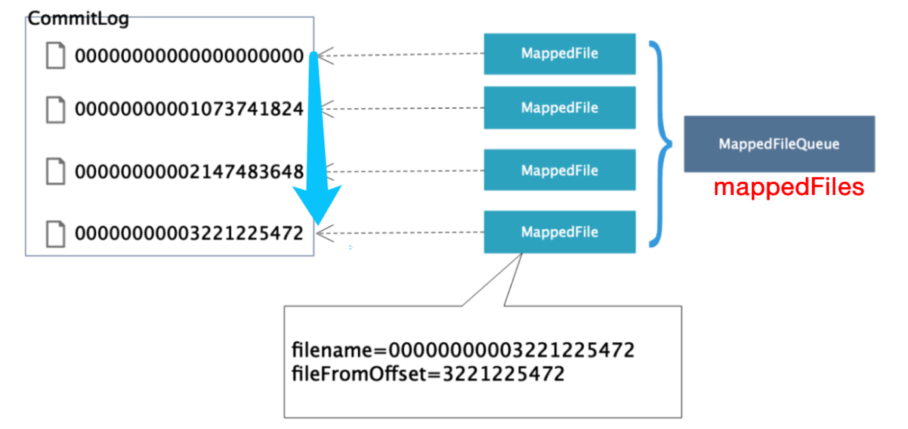
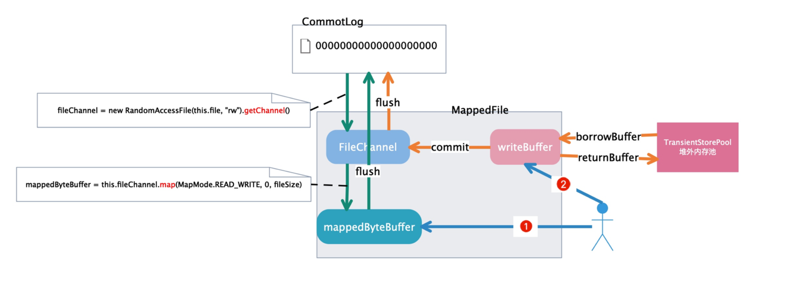

# rocketmq

### mq使用场景

解耦、异步、削峰

#### 解耦

A发送消息给BCD三个系统，如果再来一个系统或者B系统不需要了，怎么办？

需要改代码；使用mq不关心使用方，需要的来消费就可以

#### 异步

A---> B  C  D三个系统，需用同步调用，则调用时间是三个系统调用之和；

使用mq则只需要发送到mq，BCD 各自去消费即可

#### 削峰

扛流量洪峰


### 使用mq缺点

#### 系统可用性降低

依赖mq的高可用

#### 系统复杂性提供

需要处理重复消费、消息丢失等问题

#### 数据一致性问题

多个系统数据一致性问题


### Kafka vs rocketmq

http://jm.taobao.org/2016/04/07/kafka-vs-rocketmq-topic-amout/

Kafka的每个Topic、每个分区都会对应一个物理文件

RocketMQ所有的消息是保存在同一个物理文件中的，Topic和分区数对RocketMQ也只是逻辑概念上的划分


### 消息发送

##### 消息发送者启动流程

##### 消息发送流程

* 获取主题路由信息
* 队列负载；轮训队列发送，如果出现发送失败，保存错误broker信息，下次跳过错误broker
* 发送消息---->borker
* broker做消息存储

##### 消息发送高可用设计

```
集群broker-a:q0,q1,q2,q3; broker-b:q0,q1,q2,q3

正常发送为轮训发送；出现错误，会根据之前记录的发送错误的broker信息（保存在faultItemTable）

不可用期间跳过改broker
```


### 消息存储

broker消息发送处理入口：

```java
org.apache.rocketmq.broker.BrokerController：
  
SendMessageProcessor sendProcessor = new SendMessageProcessor(this);

this.fastRemotingServer.registerProcessor(RequestCode.SEND_MESSAGE, sendProcessor, this.sendMessageExecutor);

this.sendMessageExecutor = new BrokerFixedThreadPoolExecutor(
                this.brokerConfig.getSendMessageThreadPoolNums(),
                this.brokerConfig.getSendMessageThreadPoolNums(),
                1000 * 60,
                TimeUnit.MILLISECONDS,
                this.sendThreadPoolQueue,
                new ThreadFactoryImpl("SendMessageThread_"));
```

##### 内存文件映射/文件预热/内存锁定



```
流程：
broker收到消息，存储消息
	->CommitLog#putMessage 向commitLog写数据
		->commitLog实际保存的文件是MappedFile
	消息将被写入到MappedFile中，先获取最近的MappedFile：MappedFileQueue.getLastMappedFile()
  如果mappedFile为空或者已满，则需要创建新的mappedFile；
  创建新mappedFile会一次提交两个创建文件请求；
  创建请求提交给：AllocateMappedFileService 放入requestQueue中
  AllocateMappedFileService为一下线程，死循环执行mmapOperation
	文件预热:
	会在每隔pageCache大小的buffer中写入一个0
	文件内存锁定：
	(防止预热过的文件被操作系统调到swap空间，读取的时候产生缺页中断异常)

```


##### 零拷贝

mmap()  与 sendfile:

传统操作方式使用系统调用：read()/write()

涉及到多次上下文切换与数据拷贝，减少数据拷贝的方式有两种：mmap、sendfile;rocketmq使用的是mmap；


##### commitLog刷盘



- CommitRealTimeService：
- FlushRealTimeService：
- GroupCommitService：

###### 同步刷盘：

GroupCommitService:doCommit

将request放入写队列，然后唤醒线程；读写队列切换； mappedFileQueue.flush() ----> mappedByteBuffer.flush()

###### 异步刷盘：	

两种模式：

1. 使用TransientStorePool

   ```
   1. CommitRealTimeService将writeBuufer写入fileChannel:
   mappedFileQueue.commit()
   	--->mappedFile.commit() 
   		--->fileChannel.write()
   2. FlushRealTimeService 将fileChannel/mappedByteBuffer写入磁盘:
   mappedFileQueue.flush()
   	--->mappedFile.flush()
   		--->fileChannel.force() / mappedByteBuffer.force()
   ```

   

2. 不使用TransientStorePool

   同第一种情况 第二步，使用FlushRealTimeService

   

### 消息消费

nameServer

