# tomcat 

### Tomcat整体架构

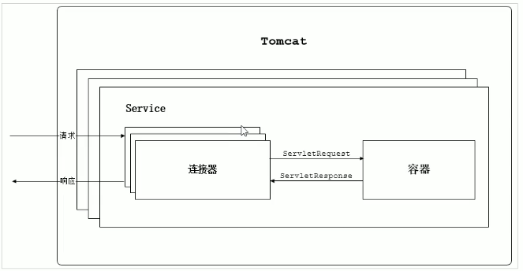

一个service单独对外提供服务，包括多个连接器一个容器；即一个容器对应多个连接器

### 连接器

Coyote主要功能：协议解析

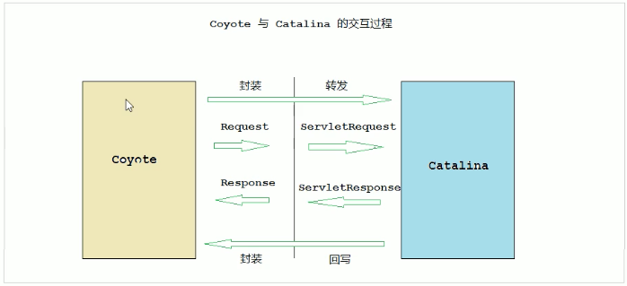

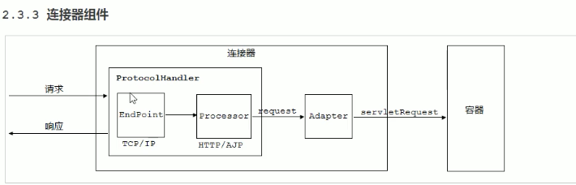

1. EndPoint 通信端点，提供的接口AbstractEndPoint；是具体socket连接和发送处理器，用来是实现TCP/IP协议

2. Processor 处理http/ajp协议，用来接受endpoint中的socket，读取字节流解析成Tomcat Request和Response对象；通过Adapter提交给

   容器处理，是对应用层协议的抽象。

3. adpter使用适配器模式，将request转化为ServletRequest

### 容器 - Catalina

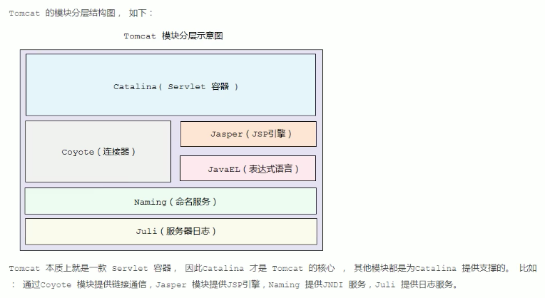

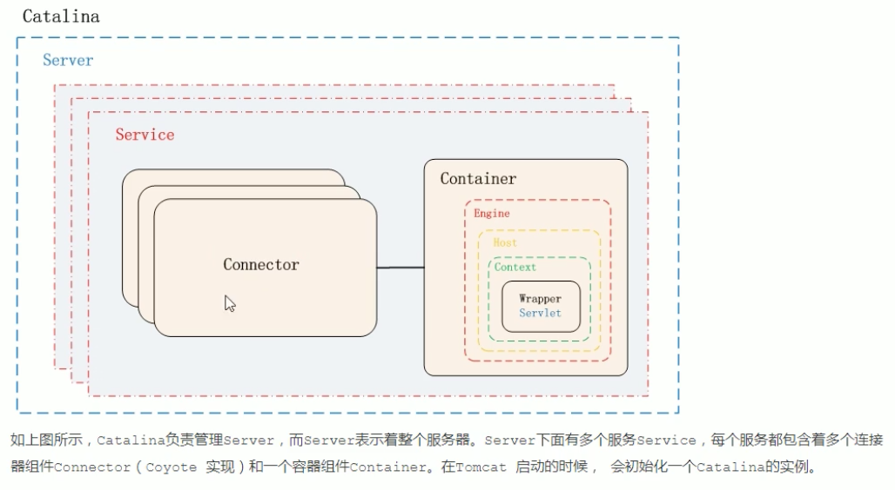

单servlet实例，多线程；线程不安全

#### 容器分层结构

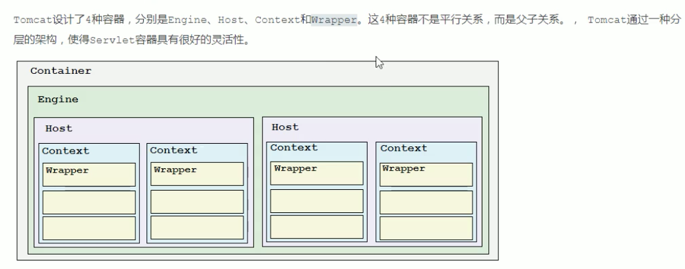

**engine:**表示Catalina的servlet引擎，用来管理多个虚拟站点(Host)，一个service只能用一个Engine

**Host:**表示一个虚拟主机，或者说一个站点

**Context:**表示一个Web应用程序，一个Web应用程序包含多个Wrapper

**Wrapper:**表示一个Servlet，Wrapper作为容器中的最底层，不能包含子容器

### Tomcat启动流程

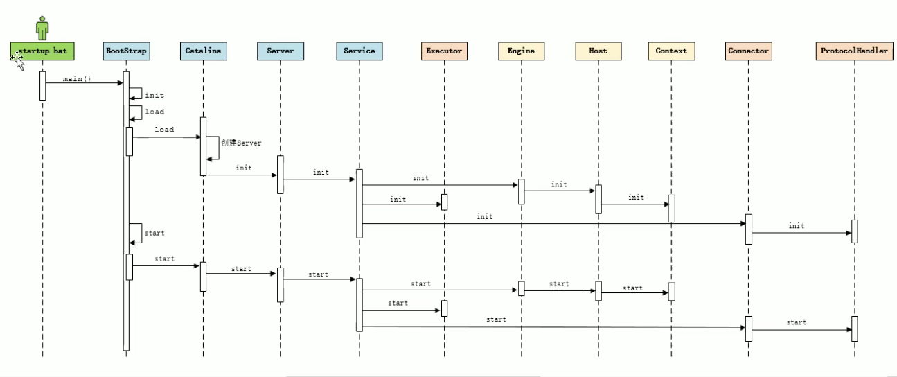

#### LifeCycle

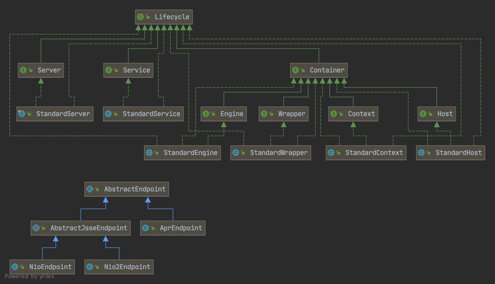

### Tomcat处理请求流程

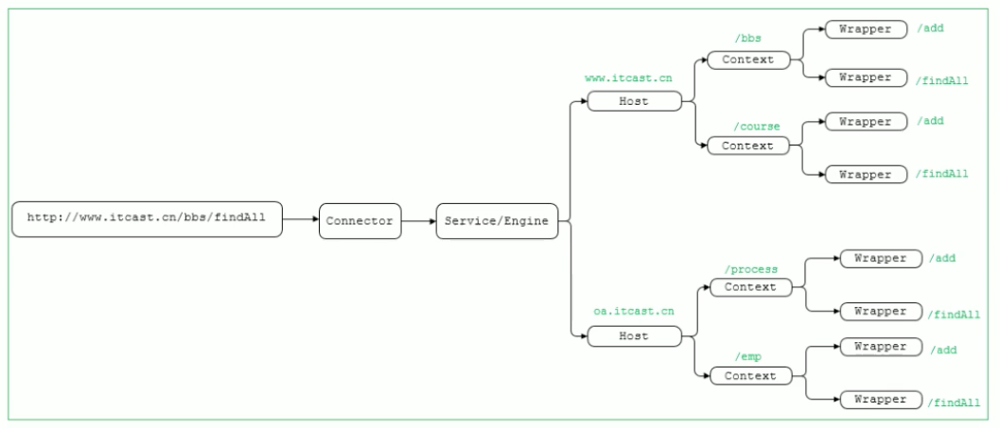

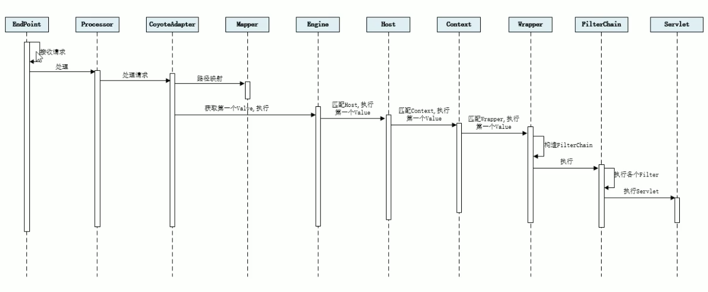

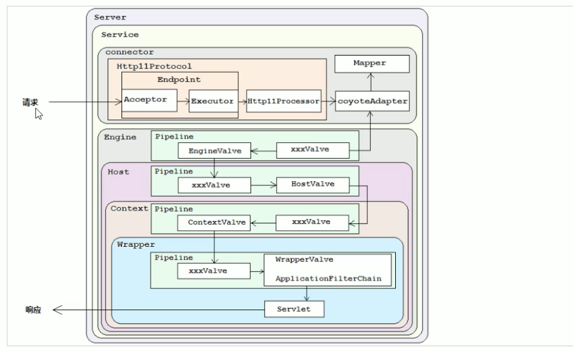s

