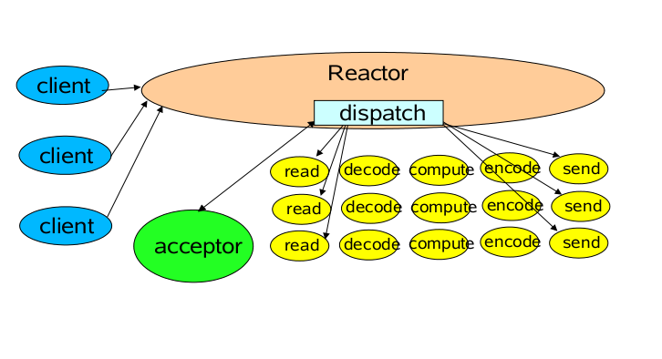
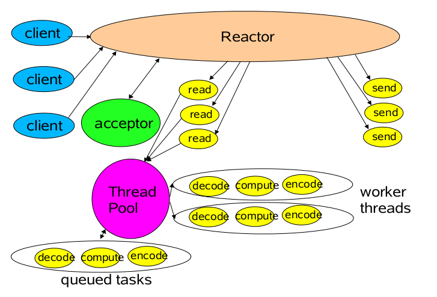
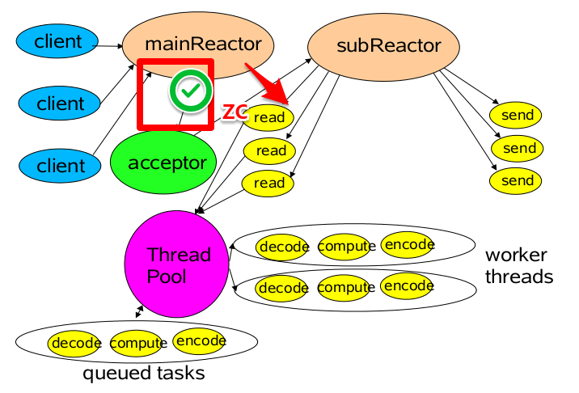
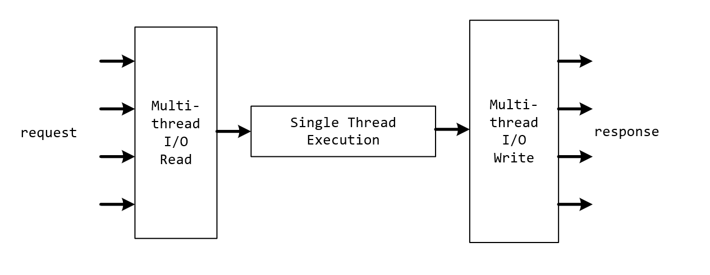

# 梳理

### 1、mysql

### 2、JVM

#### 2.1类加载器

bootStrap：java_home/lib

 ext classLoader :java_home/ext

 app (System):classpath

双亲委派模型：先由父类加载，加载不到子类再加载

类加载器命名空间：不用类加载器实例可加载同一个类，并且不是相同对象

破坏双亲委派模型：JDBC Driver

DriverManager.getConnection();   static  { init()}  

java spi:ServiceLoader.load()  在家META-INF/services  --->Class.forName() 实例化

#### 2.2 类加载过程

加载：class文件加载成二进制流

连接：

1.验证：验证文件正确性

2.准备：类变量分配空间、赋初始值

3.解析：符号引用转成直接引用

初始化：

使用：

卸载：

#### 2.3类文件

class文件结构：

基本信息：最小/大版本

常量池 constant pool

字节码指令：

iconstant/push  常量入操作数栈

iload  局部变量表-->操作数栈

istore： 操作数栈出栈到局部变量表赋值

#### 2.4运行时数据区

虚拟机栈：操作数栈、局部变量表、方法出口、动态链接

本地方法栈：本地方法

程序计数器：

堆：对象、数组

方法区：类信息、常量、静态变量、即时编译代码

#### 2.5垃圾回收算法

标记-清理：不连续空间

标记-整理：空间连续 老年代算法

复制算法：空间利用率低 有一半不会使用，年轻代使用

分代：年轻代-老年代

#### 2.6对象已死？

可达性分析： GC-ROOT

引用计数：


#### 2.7垃圾收集器

STW:stop the world

GC Root: 


serial:年轻代   单线程

serial-old：老年代 单线程

PS:多线程版本 年轻代

parallel old:并行 老年代

parallel new:

CMS：

初始化标记:stw

并行标记：时间最长，存在标记错误

重新标记：stw

清理：标记-清理

G1：

分块：

E S O  H

初始化标记：

并行标记：

再次标记：

清理：

ZGC：jdk11新增垃圾收集  

sheldon:


#### 2.8 对象分配过程：

new -->逃逸分析 -->栈上分配 --->是否大对象 --->老年代

--->TLAB  -->eden区  ---->age  ---->动态年龄判断-->老年代


#### 2.9 对象头   

mark word：

unused

hashcode

age

是否偏向锁：
锁状态：

klass pointer：

8字节 开启指针压缩：4字节

数组：

padding


#### 2.10  synchronized锁升级

mark word

无锁：

```
锁状态|hashcode|age|unused|是否偏向锁|锁标志位
0  01
```

偏向锁：

```
锁状态|threadId|是否偏向锁|锁标志位
1  01
```

轻量级锁：

lock record 栈存储  尝试去将markword 指针指向当前线程；自旋获取锁，超过一定次数后升级成重量级锁

重量级锁：

需要向操作系统内核申请mutex


字节码实现：

monitorEnter /exit

虚拟机实现：

LOCK   comxchg


#### 2.11 volatile

可见性：

顺序一致性协议

as-if-serial

缓存一致性协议

有序性：

内存屏障

不保证原子性：

底层实现：

LOCK指令  ： 独占使用内存

修改内存数据刷新到主存，是其他处理器缓存无效（缓存一致性协议）

内存屏障


#### 2.12 CAS

unsafe  compare and exchange

底层实现  comxchg 指令 LOCK_IF_MP

ABA问题：atomicStampedReference


### 3 并发编程

#### 3.1 JMM java内存模型

原子操作指令：read  load  use  assign write store lock unlock


#### 3.2 volatile  synchronized


#### 3.3 lock

ReenterantLock

ReadWriteLock

readLock ： shareLock

writeLock: exclusion Lock

StampedLock

​	

#### 3.4 AQS

volatile 修改的status

双向链表

自旋CAS

获取锁流程：

```
尝试获取锁-- 判断锁状态status ==0 ？ ---> CAS尝试更新锁状态  --->成功获取锁  更新独占锁线程
status != 0 ? --->判断是否为本线程占用锁---->是 则锁状态加1 返回true

尝试获取锁失败 ，加入队列流程
先加入到队里中
判断前序节点是头结点，则尝试获取锁
不是则判断前节点waitStatus是否为signal，如果是则park，等待唤醒
```


#### 3.5 BlockingQueue

#### 3.6并发工具

countDownLatch

cycleBarrier

exchanger

semaphore


### 4 网络编程

#### 4.1 IO

Bio:

Nio: I/0流程都是阻塞的 需要程序阻塞读

Aio:

##### 4.2 IO模型

同步阻塞：等待 内核数据准备好

同步非阻塞：轮训查看数据是否已准备好

多路复用

信号驱动

异步IO

#### 4.3 NIO流程

```java
Selector selector = Selector.open();
ServerSocketChannel serverChannel = ServerSocketChannel.open();
serverChannel.bind(8080);
serverChannel.configureBolocking(false);
serverChannel.register(selector,SelectionKey.OP_ACCEPT);
```


select/poll  epoll

Epoll:epoll_create/epoll_ctl/epoll_wait

serverChannel 注册到selector上负责接收连接请求；

新来的连接，建立socketChannel后，注册到selector上，事件op_read;

以后改客户端的所有I/O都会通过该socketChannel；

I/O流程处理则根据选择可以通过同一个线程处理，或者通过其他线程池来处理

这就对应了reactor模型

单reactor单线程模型：



单reactor多线程模型：



多reactor多线程模型：




#### 4.4 netty 对应reactor线程模型

单reactor单线程模型：bossGroup线程数设置为1，workGroup也使用bossGroup

单reactor多线程模型：bossGroup线程数设置大于1，workGroup也使用bossGroup

多reactor多线程模型：bossGroup线程数默认，workGroup使用单独线程池


#### 4.5零拷贝

传统io 拷贝与内核用户态切换

调用指令：read  write

read ===》用户态--->内核态

拷贝：DMA拷贝用内核空间 ----> 用户空间

read返回 内核态 ---> 用户态

write  ===》用户态--->内核态

拷贝：用户态--->内核态 socket buffer ---> protocol engine


mmap: mmap  write  

拷贝：hard driver --DMA-->内核buffer ---> 内核 socket buffer ---> protocol engine


sendfile: sendfile

拷贝：hard driver--DMA-->内核buffer--->socket buffer --DMA COPY-> protocol engine


DirectBuffer 堆外内存

#### 4.6 FastThreadLocal

fastThreadLocalThread

jdk threadLocal问题：使用Entry数组，hash获取数组下标，当hash冲突时速度慢

fastThreadLocal 则记录了数组index，使用的是全局Index用的使用获取即可


### 5 http / https

#### 5.1 网络分层：

```
应用层：https http IMCP

传输层：TCP UDP

网络层：IP

链路层：mac arp

物理层：
```

#### 5.2 网络数据发送的过程

发送需要五元组：cip cport sip sport protocol

#### 5.3 http安全问题

明文传输，数据安全性查

#### 5.4 https如何保证安全传输

对称加密：

非对称加密：

中间人攻击

CA认证：


### 6 redis 

#### 6.1 数据类型及应用场景

String

hash：购物车  hincry  hlen hgetall hdel 

list：列表

set：共同关注

zset：排序set

bitmap：朋友圈点赞   bloomFilter


#### 6.2 线程模型



# 梳理

### 1、mysql

### 2、JVM

#### 2.1类加载器

bootStrap：java_home/lib

 ext classLoader :java_home/ext

 app (System):classpath

双亲委派模型：先由父类加载，加载不到子类再加载

类加载器命名空间：不用类加载器实例可加载同一个类，并且不是相同对象

破坏双亲委派模型：JDBC Driver

DriverManager.getConnection();   static  { init()}  

java spi:ServiceLoader.load()  在家META-INF/services  --->Class.forName() 实例化

#### 2.2 类加载过程

加载：class文件加载成二进制流

连接：

1.验证：验证文件正确性

2.准备：类变量分配空间、赋初始值

3.解析：符号引用转成直接引用

初始化：

使用：

卸载：

#### 2.3类文件

class文件结构：

基本信息：最小/大版本

常量池 constant pool

字节码指令：

iconstant/push  常量入操作数栈

iload  局部变量表-->操作数栈

istore： 操作数栈出栈到局部变量表赋值

#### 2.4运行时数据区

虚拟机栈：操作数栈、局部变量表、方法出口、动态链接

本地方法栈：本地方法

程序计数器：

堆：对象、数组

方法区：类信息、常量、静态变量、即时编译代码

#### 2.5垃圾回收算法

标记-清理：不连续空间

标记-整理：空间连续 老年代算法

复制算法：空间利用率低 有一半不会使用，年轻代使用

分代：年轻代-老年代

#### 2.6对象已死？

可达性分析： GC-ROOT

引用计数：


#### 2.7垃圾收集器

STW:stop the world

GC Root: 


serial:年轻代   单线程

serial-old：老年代 单线程

PS:多线程版本 年轻代

parallel old:并行 老年代

parallel new:

CMS：

初始化标记:stw

并行标记：时间最长，存在标记错误

重新标记：stw

清理：标记-清理

G1：

分块：

E S O  H

初始化标记：

并行标记：

再次标记：

清理：

ZGC：jdk11新增垃圾收集  

sheldon:


#### 2.8 对象分配过程：

new -->逃逸分析 -->栈上分配 --->是否大对象 --->老年代

--->TLAB  -->eden区  ---->age  ---->动态年龄判断-->老年代


#### 2.9 对象头   

mark word：

unused

hashcode

age

是否偏向锁： 锁状态：

klass pointer：

8字节 开启指针压缩：4字节

数组：

padding


#### 2.10  synchronized锁升级

mark word

无锁：

```
 锁状态|hashcode|age|unused|是否偏向锁|锁标志位
 0  01
```

偏向锁：

```
 锁状态|threadId|是否偏向锁|锁标志位
 1  01
```

轻量级锁：

lock record 栈存储  尝试去将markword 指针指向当前线程；自旋获取锁，超过一定次数后升级成重量级锁

重量级锁：

需要向操作系统内核申请mutex


字节码实现：

monitorEnter /exit

虚拟机实现：

LOCK   comxchg


#### 2.11 volatile

可见性：

顺序一致性协议

as-if-serial

缓存一致性协议

有序性：

内存屏障

不保证原子性：

底层实现：

LOCK指令  ： 独占使用内存

修改内存数据刷新到主存，是其他处理器缓存无效（缓存一致性协议）

内存屏障


#### 2.12 CAS

unsafe  compare and exchange

底层实现  comxchg 指令 LOCK_IF_MP

ABA问题：atomicStampedReference


### 3 并发编程

#### 3.1 JMM java内存模型

原子操作指令：read  load  use  assign write store lock unlock


#### 3.2 volatile  synchronized


#### 3.3 lock

ReenterantLock

ReadWriteLock

readLock ： shareLock

writeLock: exclusion Lock

StampedLock

​	

#### 3.4 AQS

volatile 修改的status

双向链表

自旋CAS

获取锁流程：

```
 尝试获取锁-- 判断锁状态status ==0 ？ ---> CAS尝试更新锁状态  --->成功获取锁  更新独占锁线程
 status != 0 ? --->判断是否为本线程占用锁---->是 则锁状态加1 返回true
 
 尝试获取锁失败 ，加入队列流程
 先加入到队里中
 判断前序节点是头结点，则尝试获取锁
 不是则判断前节点waitStatus是否为signal，如果是则park，等待唤醒
```


#### 3.5 BlockingQueue

#### 3.6并发工具

countDownLatch

cycleBarrier

exchanger

semaphore


### 4 网络编程

#### 4.1 IO

Bio:

Nio: I/0流程都是阻塞的 需要程序阻塞读

Aio:

##### 4.2 IO模型

同步阻塞：等待 内核数据准备好

同步非阻塞：轮训查看数据是否已准备好

多路复用

信号驱动

异步IO

#### 4.3 NIO流程

```
 Selector selector = Selector.open();
 ServerSocketChannel serverChannel = ServerSocketChannel.open();
 serverChannel.bind(8080);
 serverChannel.configureBolocking(false);
 serverChannel.register(selector,SelectionKey.OP_ACCEPT);
```


select/poll  epoll

Epoll:epoll_create/epoll_ctl/epoll_wait

serverChannel 注册到selector上负责接收连接请求；

新来的连接，建立socketChannel后，注册到selector上，事件op_read;

以后改客户端的所有I/O都会通过该socketChannel；

I/O流程处理则根据选择可以通过同一个线程处理，或者通过其他线程池来处理

这就对应了reactor模型

单reactor单线程模型：


单reactor多线程模型：


多reactor多线程模型：


#### 4.4 netty 对应reactor线程模型

单reactor单线程模型：bossGroup线程数设置为1，workGroup也使用bossGroup

单reactor多线程模型：bossGroup线程数设置大于1，workGroup也使用bossGroup

多reactor多线程模型：bossGroup线程数默认，workGroup使用单独线程池


#### 4.5零拷贝

传统io 拷贝与内核用户态切换

调用指令：read  write

read ===》用户态--->内核态

拷贝：DMA拷贝用内核空间 ----> 用户空间

read返回 内核态 ---> 用户态

write  ===》用户态--->内核态

拷贝：用户态--->内核态 socket buffer ---> protocol engine


mmap: mmap  write  

拷贝：hard driver --DMA-->内核buffer ---> 内核 socket buffer ---> protocol engine


sendfile: sendfile

拷贝：hard driver--DMA-->内核buffer--->socket buffer --DMA COPY-> protocol engine


DirectBuffer 堆外内存

#### 4.6 FastThreadLocal

fastThreadLocalThread

jdk threadLocal问题：使用Entry数组，hash获取数组下标，当hash冲突时速度慢

fastThreadLocal 则记录了数组index，使用的是全局Index用的使用获取即可


### 5 http / https

#### 5.1 网络分层：

```
 应用层：https http IMCP
 
 传输层：TCP UDP
 
 网络层：IP
 
 链路层：mac arp
 
 物理层：
```

#### 5.2 网络数据发送的过程

发送需要五元组：cip cport sip sport protocol

#### 5.3 http安全问题

明文传输，数据安全性查

#### 5.4 https如何保证安全传输

对称加密：

非对称加密：

中间人攻击

CA认证：


### 6 redis 

#### 6.1 数据类型及应用场景

String

hash：购物车  hincry  hlen hgetall hdel 

list：列表

set：共同关注

zset：排序set

bitmap：朋友圈点赞   bloomFilter


#### 6.2 线程模型


#### 6.3 缓存数据一致性

更新？ 不

先删缓存后更新数据库？

先更新缓存后删除数据库？ cache aside

#### 6.4  缓存穿透

> 无key，请求到达数据库

解决方案：

1. 缓存null值+失效时间
2. bloomFilter

#### 6.5 缓存击穿

> key失效，请求到达数据库

解决方案：

1. jvm锁 + double check
2. 分布式锁

#### 6.6 缓存雪崩

> 缓存奔溃或者大面积缓存失效；打到db导致db奔溃

方案：

事前：集群高可用

事中： jvm缓存 + 限流熔断，保证db安全

事后：redis持久化 恢复

#### 6.7 持久化

RDB：save bgsave  压缩的二进制数据，恢复速度快

AOF：存的是名利  速度快  

混合：先bgsave镜像，然后执行的命令AOF

#### 6.8 分布式锁

setnx+lua： AP模型

redisson  RedLock 原理：同时发送多台redis节点，半数以上成功则成功；其实就是自己实现了一套数据一致性协议

底层命令：setNx + lua

#### 6.9 pipeline

#### 6.10 脚本

1）减少网络开销，在 Lua 脚本中可以把多个命令放在同一个脚本中运行。

2）原子操作，Redis 会将整个脚本作为一个整体执行，中间不会被其他命令插入。换句话说，编写脚本的过程中无需担心会出现竞态条件。

3）复用性，客户端发送的脚本会永远存储在 Redis 中，这意味着其他客户端可以复用这一脚本来完成同样的逻辑。

#### 6.11 事务

事务错误不回滚，错误的不影响其他命令执行

为什么不提供回滚：入队的时候无法检测到，一般是程序的代码bug，redis不保存你bug引起的错误

#### 6.12 热点key

热key检测，---> zk --->jvm缓存


### 7 zookeeper

#### 7.1 数据节点

临时节点

临时有序节点

持久节点

持久有序节点

