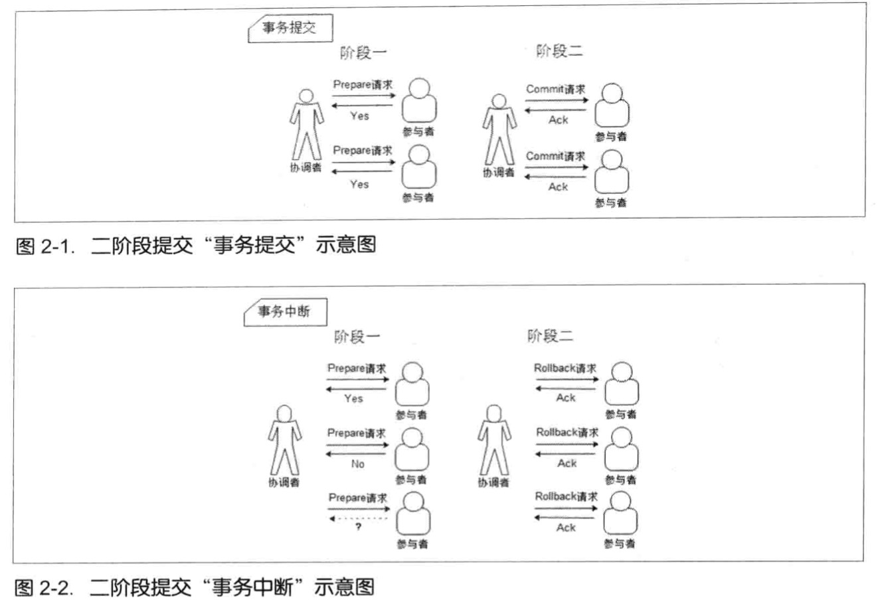

# zookeeper

## 分布式环境遇到的问题

1. 通信异常
2. 网络分区
3. 三态
   成功、失败、超时
4. 节点故障


## CAP

#### 一致性

分布式环境下，一致性是指数据在多个副本之间是否能够保持一致的特性。当一个系统在数据一致的状态下执行更新操作后，应该保证系统的数据任然处于一致的状态

#### 可用性

系统提供的服务必须一致处于可用状态，对于用户的每一个操作请求总是能够在**有限的时间内** **返回结果**

#### 分区容错性

分布式系统在遇到网络分区故障的时候，任然需要能够保证对外提供满足一致性和可用性的服务，除非是整个网络环境都发生了故障。


## BASE

#### Basically Available(基本可用)

分布式系统出现不可预知故障的时候，允许损失部分可用性

* 响应时间上的损失
* 功能上的损失
  秒杀部分用户被引导到降级页面

#### Soft state(软状态)

允许系统中的数据存在中间状态，并认为该中间状态的存在不会影响系统的整体可用性

#### Eventually consitent(最终一致性)

系统中的所有数据副本，在经过一段时间的同步后，最终能够达到一个一致的状态，不需要实时保证数据的强一致性。


## 一致性协议

#### 2PC(二阶段提交)



`关系型数据基本都采用二阶段提交来完成分布式事务处理：redo log(prepare)->binlog->redo log(commit)`

优点：原理简单、实现方便

缺点：

1. 同步阻塞
2. 单点问题
   协调者单点
3. 脑裂
   二阶段由于网络异常或者协调者在尚未发送完commit请求之前自身发生崩溃，导致部分参与者收到commit，导致只有部分提供数据，数据不一致
4. 太过保守
   任何一个节点失败都会导致整个事务的失败


#### 3PC(三阶段提交)

1. canCommit
2. preCommit
3. doCommit


## Paxos

#### Basic Paxos


#### Multi Paxos

multi Paxos 与raft类型，只是一些定义不一样

epoch <---> term

Proposal   leader

#### 


## ZAB


```
ZAB协议定义了选举（election）、发现（discovery）、同步（sync）、广播(Broadcast)四个阶段。

选举（election）是选出哪台为主机；
发现（discovery）、同步（sync）当主选出后，要做的恢复数据的阶段；

广播(Broadcast)当主机和从选出并同步好数据后，正常的主写同步从写数据的阶段。
```


集群角色：

leader 

follower

observer:不参与选举


### Leader选举

##### 遵循的原则：

**1、选举投票必须在同一轮次中进行**

如果Follower服务选举轮次不同，不会采纳投票。

**2、数据最新的节点优先成为Leader**

zxid:事务id

数据的新旧使用事务ID判定，事务ID越大认为节点数据约接近Leader的数据，自然应该成为Leader。

**3、比较server.id，id值大的优先成为Leader**

如果每个参与竞选节点事务ID一样，再使用server.id做比较。server.id是节点在集群中唯一的id，myid文件中配置。

##### 选举算法

###### fast paxos

默认ZAB采用的算法是fast paxos算法。

每次选举都要把选举轮数加一，类似于zxid里的epoch字段，防止不同轮次的选举互相干扰。

每个进入looking状态的节点，最开始投票给自己，然后把投票消息发给其它机器。内容为**<第几轮投票，被投节点的zxid，被投节点的编号>**。

其他looking状态的节点收到后，

1 首先判断票是否有效。 是否有效的方法为看票的投票轮数和本地记载的投票轮数是否相等：

2.1 如果比本地投票轮数的小，丢弃。

2.2 如果比本地投票轮数的大

```
证明自己投票过期了，清空本地投票信息，更新投票轮数和结果为收到的内容。通知其他所有节点新的投票方案。
```

2.3 如果和本地投票轮数相等，按照投票的优先级比较收到的选票和自己投出去的选票。

```
2.3.1 如果收到的优先级大，更新自己的投票为对方发过来投票方案，把投票发出去。2.3.2 如果收到的优先级小，则忽略该投票。2.3.3 如果收到的优先级相等，则更新对应节点的投票。
```

3 每收集到一个投票后，查看已经收到的投票结果记录列表，看是否有节点能够达到一半以上的投票数。如果有达到，则终止投票，宣布选举结束，更新自身状态。然后进行发现和同步阶段。 否则继续收集投票。

###### basic paxos

1 每个looking节点先发出请求，询问其他节点的投票。

其他节点返回自己的投票 < zk的id，zxid >。第一次都投自己。

2 收到结果后，如果收到的投票比自己投票的zxid大，更新自己的投票。

3 当收到所有节点返回后，统计投票，有一个节点的选举达到一半以上，则选举成功。 否则继续开始下一轮询问，直到选择出leader结束。

###### basic paxos和fast paxos区别

这里fast是主动推送出，只要结果有更新，就马上同步给其他节点。其他节点可能还没把自己的票通知给所有节点，就发现自己投的票优先级低，要更新投票，然后更新再重新通知给所有节点。

basic则要每一节点都询问完，才能知道新结果，然后再去问其他节点新的选举结果。

fast比basic快的地方，是一个节点，不用和每个节点都交换投票信息后，才能知道自己的票是否要更新。会减少交互次数。


## zookeeper脑裂问题

脑裂(split-brain)就是“大脑分裂”,集群出现多个leader；当网络分区出现，集群会从新选举leader

**过半机制**   保证集群要么不可用，要么只有一个leader


## zookeeper源码分析

#### 服务器启动

#### 领导人选举

领导人选举过程：

1. 投给自己
2. 接受其他服务器的投票
3. pk
4. 投票
5. 放到投票箱
6. 统计

#### 请求处理

